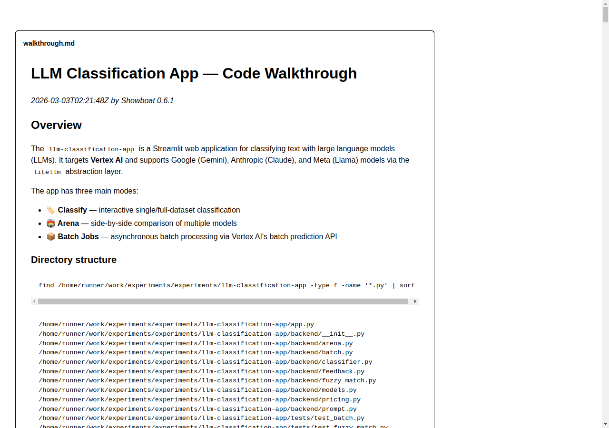
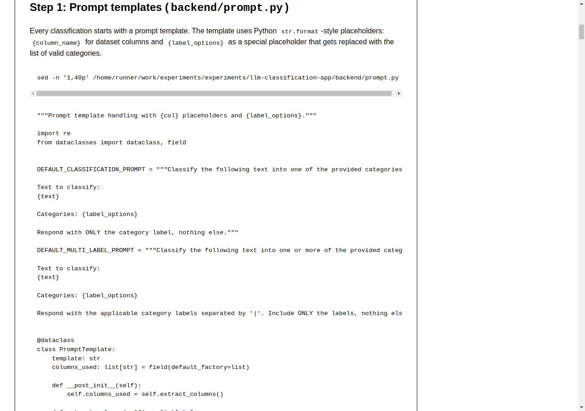
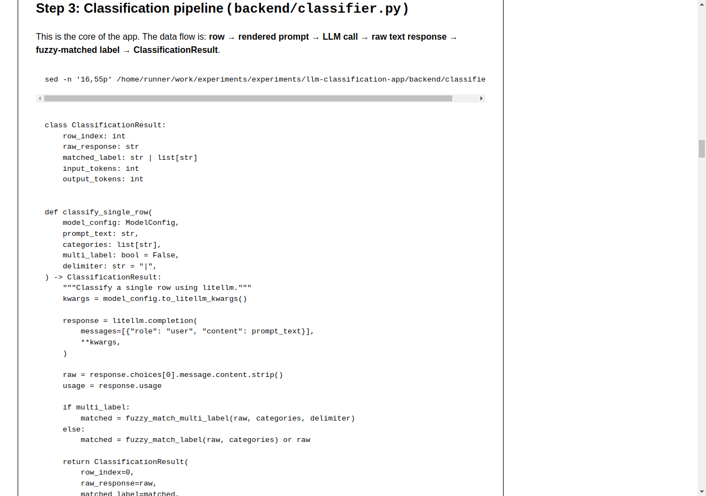
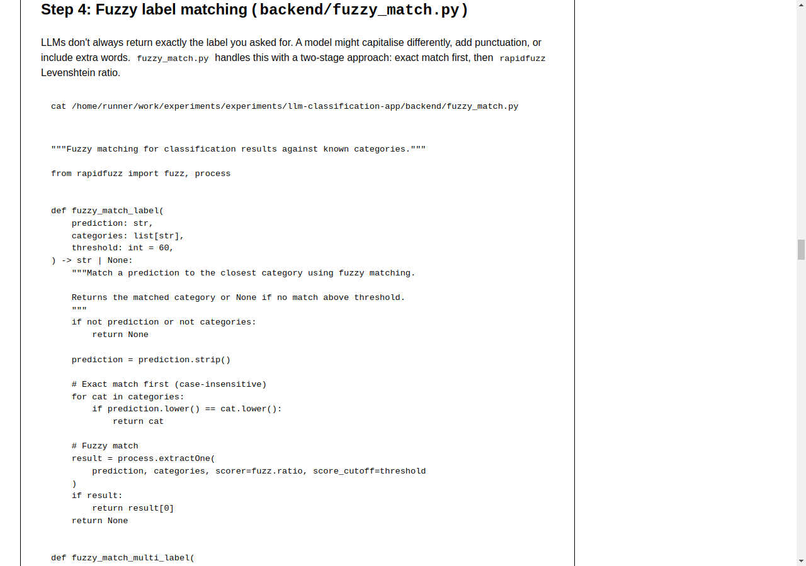
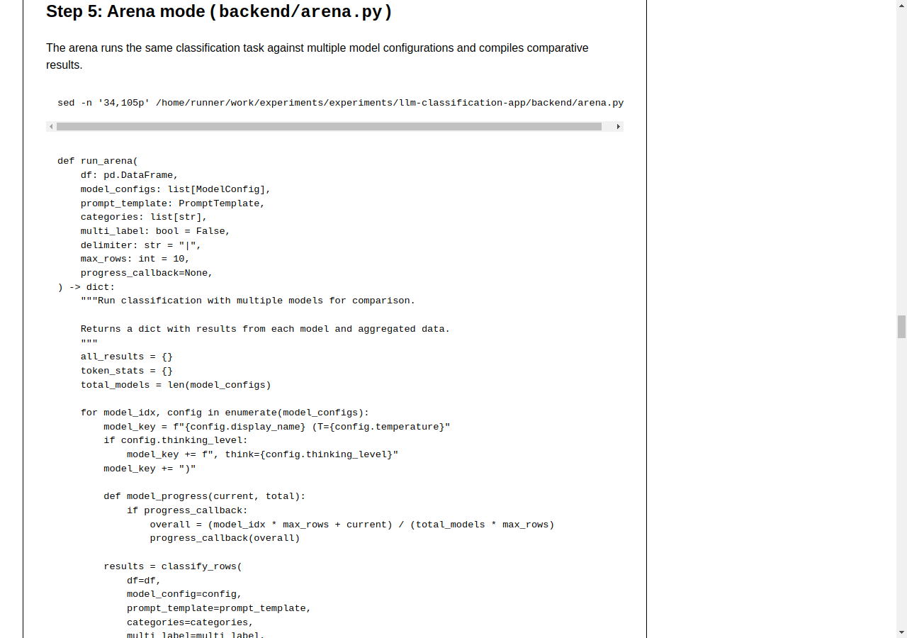
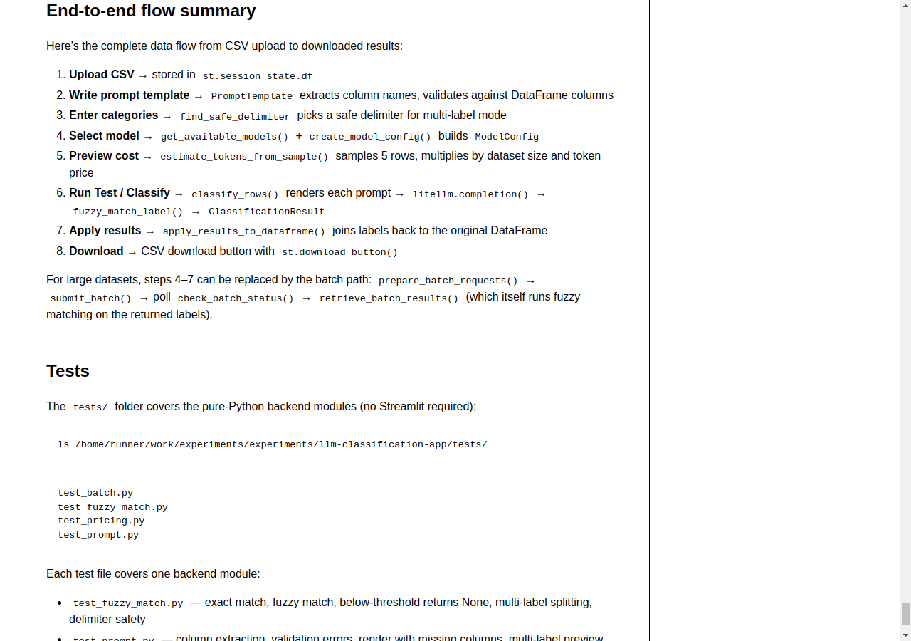

# LLM Classification App — Code Walkthrough

*2026-03-05T00:22:16Z by Showboat 0.6.1*
<!-- showboat-id: f1a628b4-abe9-4465-b36a-ac965365db16 -->

## Overview

The `llm-classification-app` is a Streamlit web application for classifying text with large language models. It targets **Vertex AI** and supports Google (Gemini), Anthropic (Claude), and Meta (Llama) models via the `litellm` abstraction layer.

The app has three main modes:
- **🏷️ Classify** — interactive single/full-dataset classification with cost estimation
- **🏟️ Arena** — side-by-side multi-model comparison with an optional LLM judge
- **📦 Batch Jobs** — asynchronous Vertex AI batch prediction for large datasets

The backend is a clean Python package that is fully independent of Streamlit — all business logic lives in `backend/` and can be tested or called from other interfaces without touching the UI layer.

```bash {image}
/home/runner/work/experiments/experiments/code-walkthrough/final_01_title.png
```



### Directory layout

The project has a clean separation: `app.py` is the Streamlit frontend; `backend/` contains all business logic; `tests/` covers the backend without any UI dependency.

```bash
find /home/runner/work/experiments/experiments/llm-classification-app -type f -name '*.py' | sed "s|/home/runner/work/experiments/experiments/llm-classification-app/||" | sort
```

```output
app.py
backend/__init__.py
backend/arena.py
backend/batch.py
backend/classifier.py
backend/feedback.py
backend/fuzzy_match.py
backend/models.py
backend/pricing.py
backend/prompt.py
tests/test_batch.py
tests/test_fuzzy_match.py
tests/test_pricing.py
tests/test_prompt.py
```

---

## Step 1: Prompt templates (`backend/prompt.py`)

Every classification starts with a prompt template. The template uses Python `str.format`-style placeholders: `{column_name}` for CSV columns and `{label_options}` as the reserved placeholder for the list of valid categories.

The two built-in defaults show the pattern clearly:

```bash
sed -n '6,23p' /home/runner/work/experiments/experiments/llm-classification-app/backend/prompt.py
```

```output

DEFAULT_CLASSIFICATION_PROMPT = """Classify the following text into one of the provided categories.

Text to classify:
{text}

Categories: {label_options}

Respond with ONLY the category label, nothing else."""

DEFAULT_MULTI_LABEL_PROMPT = """Classify the following text into one or more of the provided categories.

Text to classify:
{text}

Categories: {label_options}

Respond with the applicable category labels separated by '|'. Include ONLY the labels, nothing else."""
```

`PromptTemplate` wraps the raw string. On construction it extracts column references using a regex over `{word}` patterns, filtering out the reserved `label_options` placeholder. This list is used for validation and prompt preview in the UI:

```bash
sed -n '27,75p' /home/runner/work/experiments/experiments/llm-classification-app/backend/prompt.py
```

```output
class PromptTemplate:
    template: str
    columns_used: list[str] = field(default_factory=list)

    def __post_init__(self):
        self.columns_used = self.extract_columns()

    def extract_columns(self) -> list[str]:
        """Extract column placeholders from template, excluding label_options."""
        placeholders = re.findall(r"\{(\w+)\}", self.template)
        return [p for p in placeholders if p != "label_options"]

    def validate(self, available_columns: list[str]) -> list[str]:
        """Validate template against available columns. Returns list of errors."""
        errors = []
        for col in self.columns_used:
            if col not in available_columns:
                errors.append(f"Column '{col}' not found in dataset")
        if "{label_options}" not in self.template:
            errors.append("Template should include {label_options} placeholder")
        return errors

    def check_warnings(self, available_columns: list[str]) -> list[str]:
        """Check for warnings (non-fatal issues)."""
        warnings = []
        if "label_options" in available_columns:
            warnings.append(
                "⚠️ 'label_options' is both a column name and a special placeholder. "
                "The placeholder {label_options} will be replaced with categories, "
                "not the column value."
            )
        return warnings

    def render(
        self, row: dict, categories: list[str], multi_label: bool = False,
        delimiter: str = "|",
    ) -> str:
        """Render the prompt for a specific row."""
        label_str = ", ".join(categories)
        values = {"label_options": label_str}
        for col in self.columns_used:
            values[col] = str(row.get(col, f"[missing:{col}]"))
        try:
            return self.template.format(**values)
        except KeyError as e:
            return f"Error rendering prompt: missing key {e}"

    def preview(
        self, first_row: dict, categories: list[str], multi_label: bool = False,
```

`render()` builds a values dict with `label_options` set to a comma-joined category string, then fills each referenced column from the row dict. Missing columns are substituted with `[missing:col]` rather than raising — so partial data still produces a visible prompt. `template.format(**values)` does the final substitution.

```bash {image}
/home/runner/work/experiments/experiments/code-walkthrough/final_02_step1_prompt.png
```



---

## Step 2: Model configuration (`backend/models.py` + `backend/pricing.py`)

Before calling any LLM, the app needs to know which model to call and how much it costs. `ModelConfig` is a dataclass that holds everything `litellm.completion()` needs and converts it to ready-to-unpack kwargs.

The `thinking_level` handling is the most interesting part — Gemini and Claude both support extended reasoning but their APIs differ. The same three levels ('low', 'medium', 'high') map to different token budgets per vendor:

```bash
sed -n '8,46p' /home/runner/work/experiments/experiments/llm-classification-app/backend/models.py
```

```output
class ModelConfig:
    """Configuration for a model run."""
    vertex_id: str
    display_name: str
    vendor: str
    price: ModelPrice | None = None
    temperature: float = 0.0
    max_tokens: int = 4096
    thinking_level: str | None = None  # "low", "medium", "high" for supported models
    extra_params: dict = field(default_factory=dict)

    def to_litellm_kwargs(self) -> dict:
        """Convert to kwargs for litellm.completion()."""
        kwargs = {
            "model": self.vertex_id,
            "temperature": self.temperature,
            "max_tokens": self.max_tokens,
        }
        # Thinking budget / effort for models that support it
        if self.thinking_level:
            if "gemini" in self.vertex_id.lower():
                # Gemini uses thinking_config
                budget_map = {"low": 1024, "medium": 8192, "high": 32768}
                kwargs["thinking"] = {
                    "type": "enabled",
                    "budget_tokens": budget_map.get(self.thinking_level, 8192),
                }
            elif "claude" in self.vertex_id.lower():
                # Claude uses extended thinking
                budget_map = {"low": 2048, "medium": 10000, "high": 32000}
                kwargs["thinking"] = {
                    "type": "enabled",
                    "budget_tokens": budget_map.get(self.thinking_level, 10000),
                }
        kwargs.update(self.extra_params)
        return kwargs


# Thinking level options per vendor
```

Pricing data comes from the `llm-prices` git submodule — a folder of JSON files keyed by vendor. `load_all_prices()` scans them, picks the first (newest) entry from each model's `price_history`, and returns a flat dict. If the submodule hasn't been initialised, the function returns an empty dict and the app still runs without cost estimates.

```bash
sed -n '56,82p' /home/runner/work/experiments/experiments/llm-classification-app/backend/pricing.py
```

```output
    """Load pricing for all models, keyed by llm-prices model id."""
    prices: dict[str, ModelPrice] = {}
    data_dir = _prices_dir()
    if not data_dir.exists():
        return prices
    for json_file in sorted(data_dir.glob("*.json")):
        try:
            data = json.loads(json_file.read_text())
        except (json.JSONDecodeError, OSError):
            continue
        vendor = data.get("vendor", json_file.stem)
        for model in data.get("models", []):
            model_id = model["id"]
            history = model.get("price_history", [])
            if not history:
                continue
            latest = history[0]
            prices[model_id] = ModelPrice(
                model_id=model_id,
                name=model.get("name", model_id),
                vendor=vendor,
                input_per_mtok=latest.get("input", 0),
                output_per_mtok=latest.get("output", 0),
                input_cached_per_mtok=latest.get("input_cached"),
            )
    return prices

```

---

## Step 3: Classification pipeline (`backend/classifier.py`)

This is the core of the app. The data flow is: **row → rendered prompt → LLM call → raw text response → fuzzy-matched label → ClassificationResult**.

`classify_single_row` is deliberately thin — it calls `litellm.completion()`, extracts the raw response, then delegates to the fuzzy-match layer. Both the raw text and the normalised label are kept in the result:

```bash
sed -n '16,52p' /home/runner/work/experiments/experiments/llm-classification-app/backend/classifier.py
```

```output
class ClassificationResult:
    row_index: int
    raw_response: str
    matched_label: str | list[str]
    input_tokens: int
    output_tokens: int


def classify_single_row(
    model_config: ModelConfig,
    prompt_text: str,
    categories: list[str],
    multi_label: bool = False,
    delimiter: str = "|",
) -> ClassificationResult:
    """Classify a single row using litellm."""
    kwargs = model_config.to_litellm_kwargs()

    response = litellm.completion(
        messages=[{"role": "user", "content": prompt_text}],
        **kwargs,
    )

    raw = response.choices[0].message.content.strip()
    usage = response.usage

    if multi_label:
        matched = fuzzy_match_multi_label(raw, categories, delimiter)
    else:
        matched = fuzzy_match_label(raw, categories) or raw

    return ClassificationResult(
        row_index=0,
        raw_response=raw,
        matched_label=matched,
        input_tokens=usage.prompt_tokens if usage else 0,
        output_tokens=usage.completion_tokens if usage else 0,
```

```bash {image}
/home/runner/work/experiments/experiments/code-walkthrough/final_03_step3_classifier.png
```



`classify_rows` wraps the single-row function in a loop with an optional `max_rows` cap and a `progress_callback` — a simple `Callable(current, total)`. There is no Streamlit code in the backend; `app.py` passes a lambda that calls `st.progress()`; tests pass `None`.

Token estimation before running costs nothing — `estimate_tokens_from_sample` samples up to 5 rows using `litellm.token_counter()`, with a `len(text) // 4` character-based fallback when the tokenizer isn't available:

```bash
sed -n '100,115p' /home/runner/work/experiments/experiments/llm-classification-app/backend/classifier.py
```

```output
def count_tokens_for_prompt(prompt_text: str, model_id: str) -> int:
    """Estimate token count for a prompt using litellm.

    Falls back to character-based estimation (~4 chars/token) if
    litellm token counting fails (e.g., unsupported model, missing tokenizer).
    """
    try:
        return litellm.token_counter(model=model_id, text=prompt_text)
    except Exception:
        return len(prompt_text) // 4


def estimate_tokens_from_sample(
    df: pd.DataFrame,
    prompt_template: PromptTemplate,
    categories: list[str],
```

---

## Step 4: Fuzzy label matching (`backend/fuzzy_match.py`)

LLMs don't always return exactly the label you asked for. `fuzzy_match.py` handles this with a two-stage approach: exact match first (case-insensitive), then `rapidfuzz` Levenshtein ratio with a score cutoff of 60. Scores below 60 return `None`, causing the caller to keep the raw response rather than silently map to a wrong label.

```bash
cat /home/runner/work/experiments/experiments/llm-classification-app/backend/fuzzy_match.py
```

```output
"""Fuzzy matching for classification results against known categories."""

from rapidfuzz import fuzz, process


def fuzzy_match_label(
    prediction: str,
    categories: list[str],
    threshold: int = 60,
) -> str | None:
    """Match a prediction to the closest category using fuzzy matching.

    Returns the matched category or None if no match above threshold.
    """
    if not prediction or not categories:
        return None

    prediction = prediction.strip()

    # Exact match first (case-insensitive)
    for cat in categories:
        if prediction.lower() == cat.lower():
            return cat

    # Fuzzy match
    result = process.extractOne(
        prediction, categories, scorer=fuzz.ratio, score_cutoff=threshold
    )
    if result:
        return result[0]
    return None


def fuzzy_match_multi_label(
    prediction: str,
    categories: list[str],
    delimiter: str = "|",
    threshold: int = 60,
) -> list[str]:
    """Match multi-label predictions to categories.

    Splits prediction by delimiter and fuzzy-matches each part.
    """
    if not prediction:
        return []

    parts = [p.strip() for p in prediction.split(delimiter) if p.strip()]
    matched = []
    for part in parts:
        match = fuzzy_match_label(part, categories, threshold)
        if match and match not in matched:
            matched.append(match)
    return matched


def find_safe_delimiter(categories: list[str]) -> str:
    """Find a delimiter that doesn't appear in any category label."""
    candidates = ["|", "||", ";;", "###", "^^^"]
    for delim in candidates:
        if not any(delim in cat for cat in categories):
            return delim
    return "|||"
```

`find_safe_delimiter` ensures the delimiter chosen for multi-label output doesn't appear inside any category name (which would cause incorrect splits). It tries candidates in order: `|`, `||`, `;;`, `###`, `^^^`.

```bash {image}
/home/runner/work/experiments/experiments/code-walkthrough/final_04_step4_fuzzy.png
```



---

## Step 5: Arena mode (`backend/arena.py`)

The arena runs the same classification task against multiple model configurations and compiles comparative results. `run_arena` iterates each config, calling `classify_rows` for each. The inner `model_progress` closure converts per-model progress into a smooth overall fraction across all models:

```bash
sed -n '34,98p' /home/runner/work/experiments/experiments/llm-classification-app/backend/arena.py
```

```output
def run_arena(
    df: pd.DataFrame,
    model_configs: list[ModelConfig],
    prompt_template: PromptTemplate,
    categories: list[str],
    multi_label: bool = False,
    delimiter: str = "|",
    max_rows: int = 10,
    progress_callback=None,
) -> dict:
    """Run classification with multiple models for comparison.

    Returns a dict with results from each model and aggregated data.
    """
    all_results = {}
    token_stats = {}
    total_models = len(model_configs)

    for model_idx, config in enumerate(model_configs):
        model_key = f"{config.display_name} (T={config.temperature}"
        if config.thinking_level:
            model_key += f", think={config.thinking_level}"
        model_key += ")"

        def model_progress(current, total):
            if progress_callback:
                overall = (model_idx * max_rows + current) / (total_models * max_rows)
                progress_callback(overall)

        results = classify_rows(
            df=df,
            model_config=config,
            prompt_template=prompt_template,
            categories=categories,
            multi_label=multi_label,
            delimiter=delimiter,
            max_rows=max_rows,
            progress_callback=model_progress,
        )

        all_results[model_key] = results

        # Calculate token stats
        total_input = sum(r.input_tokens for r in results)
        total_output = sum(r.output_tokens for r in results)
        avg_input = total_input / len(results) if results else 0
        avg_output = total_output / len(results) if results else 0

        token_stats[model_key] = {
            "avg_input_tokens": avg_input,
            "avg_output_tokens": avg_output,
            "total_input_tokens": total_input,
            "total_output_tokens": total_output,
            "sample_cost": config.price.estimate_cost(total_input, total_output)
            if config.price
            else 0,
            "estimated_full_cost": estimate_dataset_cost(
                config.price, avg_input, avg_output, len(df)
            )
            if config.price
            else 0,
        }

    return {
        "results": all_results,
```

```bash {image}
/home/runner/work/experiments/experiments/code-walkthrough/final_05_step5_arena.png
```



After the arena runs, an optional judge LLM evaluates all models' outputs. It receives each row's source text and all labels, but *not* the category list — avoiding bias towards whichever label appears first. The judge responds in JSON with the best model and a justification per row:

```bash
sed -n '104,148p' /home/runner/work/experiments/experiments/llm-classification-app/backend/arena.py
```

```output
def judge_arena_results(
    arena_results: dict,
    df: pd.DataFrame,
    prompt_template: PromptTemplate,
    categories: list[str],
    judge_config: ModelConfig,
    judge_prompt: str = DEFAULT_JUDGE_PROMPT,
    max_rows: int = 10,
) -> str:
    """Use a judge model to evaluate arena results.

    Categories are excluded from the judge prompt to avoid biasing
    the evaluation — the judge should assess quality based solely
    on how well each classification matches the source text.
    """
    # Build classification summary for judge
    classifications_text = ""
    rows_to_show = min(max_rows, len(df))

    for row_idx in range(rows_to_show):
        row = df.iloc[row_idx]
        # Show the text columns used in the prompt
        cols_used = prompt_template.columns_used
        text_preview = " | ".join(
            f"{col}: {row.get(col, 'N/A')}" for col in cols_used
        )
        classifications_text += f"\n--- Row {row_idx} ---\n"
        classifications_text += f"Text: {text_preview}\n"

        for model_key, results in arena_results["results"].items():
            if row_idx < len(results):
                label = results[row_idx].matched_label
                if isinstance(label, list):
                    label = " | ".join(label)
                classifications_text += f"  {model_key}: {label}\n"

    final_prompt = judge_prompt.format(classifications=classifications_text)

    kwargs = judge_config.to_litellm_kwargs()
    kwargs["max_tokens"] = 4096

    response = litellm.completion(
        messages=[{"role": "user", "content": final_prompt}],
        **kwargs,
    )
```

---

## Step 6: Batch jobs (`backend/batch.py`)

For large datasets, calling the API row-by-row is slow and can't be resumed if it fails partway through. The batch module uses Vertex AI's native batch prediction endpoint instead.

State persistence is file-based: each submitted batch gets its own JSON file in `batch_state/`. This means jobs survive Streamlit restarts without a database.

```bash
sed -n '20,65p' /home/runner/work/experiments/experiments/llm-classification-app/backend/batch.py
```

```output
def _ensure_batch_dir():
    BATCH_STATE_DIR.mkdir(parents=True, exist_ok=True)


def save_batch_id(batch_id: str, metadata: dict | None = None):
    """Persist a batch ID to file for recovery."""
    _ensure_batch_dir()
    record = {
        "batch_id": batch_id,
        "created_at": datetime.now().isoformat(),
        "status": "submitted",
        **(metadata or {}),
    }
    filepath = BATCH_STATE_DIR / f"{batch_id}.json"
    filepath.write_text(json.dumps(record, indent=2))


def update_batch_status(batch_id: str, status: str, extra: dict | None = None):
    """Update the status of a tracked batch."""
    filepath = BATCH_STATE_DIR / f"{batch_id}.json"
    if filepath.exists():
        record = json.loads(filepath.read_text())
    else:
        record = {"batch_id": batch_id}
    record["status"] = status
    record["updated_at"] = datetime.now().isoformat()
    if extra:
        record.update(extra)
    filepath.write_text(json.dumps(record, indent=2))


def load_tracked_batches() -> list[dict]:
    """Load all tracked batch records."""
    _ensure_batch_dir()
    batches = []
    for f in BATCH_STATE_DIR.glob("*.json"):
        try:
            batches.append(json.loads(f.read_text()))
        except (json.JSONDecodeError, OSError):
            continue
    return sorted(batches, key=lambda b: b.get("created_at", ""), reverse=True)


def cleanup_batch(batch_id: str):
    """Remove batch tracking file after completion."""
    filepath = BATCH_STATE_DIR / f"{batch_id}.json"
```

`prepare_batch_requests` formats each row as a JSONL entry. Each request gets a `custom_id` of `row-{idx}` so results can be matched back to the original rows. The `vertex_ai/` prefix is stripped from the model ID because the batch API expects the bare model name:

```bash
sed -n '70,103p' /home/runner/work/experiments/experiments/llm-classification-app/backend/batch.py
```

```output
def prepare_batch_requests(
    df: pd.DataFrame,
    model_config: ModelConfig,
    prompt_template: PromptTemplate,
    categories: list[str],
    multi_label: bool = False,
    delimiter: str = "|",
) -> list[dict]:
    """Prepare batch request payloads for Vertex AI batch prediction.

    Returns a list of request dicts in the format expected by Vertex AI
    batch prediction (JSONL format).
    """
    requests = []
    for idx, (_, row) in enumerate(df.iterrows()):
        prompt_text = prompt_template.render(
            row.to_dict(), categories, multi_label, delimiter
        )
        request = {
            "custom_id": f"row-{idx}",
            "method": "POST",
            "url": "/v1/chat/completions",
            "body": {
                "model": model_config.vertex_id.replace("vertex_ai/", ""),
                "messages": [{"role": "user", "content": prompt_text}],
                "max_tokens": model_config.max_tokens,
                "temperature": model_config.temperature,
            },
        }
        requests.append(request)
    return requests


def submit_batch(
```

`submit_batch` writes the requests to a temp JSONL file, calls `litellm.create_batch()`, saves the returned batch ID, then cleans up the temp file in `finally` — ensuring no temp files leak even if submission fails:

```bash
sed -n '103,140p' /home/runner/work/experiments/experiments/llm-classification-app/backend/batch.py
```

```output
def submit_batch(
    requests: list[dict],
    model_config: ModelConfig,
    description: str = "",
) -> str:
    """Submit a batch job to Vertex AI.

    Returns the batch ID for tracking.
    """
    import tempfile

    # Write requests to a JSONL file
    with tempfile.NamedTemporaryFile(
        mode="w", suffix=".jsonl", delete=False
    ) as f:
        for req in requests:
            f.write(json.dumps(req) + "\n")
        jsonl_path = f.name

    try:
        # Use litellm's batch API
        batch_response = litellm.create_batch(
            input_file_id=jsonl_path,
            endpoint="/v1/chat/completions",
            completion_window="24h",
            metadata={"description": description},
        )
        batch_id = batch_response.id

        # Save batch ID for recovery
        save_batch_id(batch_id, {
            "model": model_config.vertex_id,
            "description": description,
            "num_requests": len(requests),
        })

        return batch_id
    finally:
```

```bash {image}
/home/runner/work/experiments/experiments/code-walkthrough/final_06_e2e.png
```



---

## Step 7: Prompt feedback (`backend/feedback.py`)

A compact but useful feature: ask an LLM to critique your classification prompt and categories before running on the full dataset. The `FEEDBACK_PROMPT` (defined in `prompt.py`) asks for structured critique across six dimensions — clarity, category overlap, missing catch-all, prompt quality, category count, and a RAG recommendation for very long prompts:

```bash
cat /home/runner/work/experiments/experiments/llm-classification-app/backend/feedback.py
```

```output
"""AI feedback on prompts and categories."""

import litellm
from backend.models import ModelConfig
from backend.prompt import FEEDBACK_PROMPT


def get_prompt_feedback(
    model_config: ModelConfig,
    prompt_template: str,
    categories: list[str],
    multi_label: bool = False,
) -> str:
    """Get AI feedback on the classification prompt and categories."""
    classification_type = "multi-label" if multi_label else "single-label"
    categories_str = "\n".join(f"- {cat}" for cat in categories)

    feedback_prompt = FEEDBACK_PROMPT.format(
        prompt=prompt_template,
        categories=categories_str,
        classification_type=classification_type,
    )

    kwargs = model_config.to_litellm_kwargs()
    # Override max_tokens for feedback - needs room for detailed response
    kwargs["max_tokens"] = 4096

    response = litellm.completion(
        messages=[{"role": "user", "content": feedback_prompt}],
        **kwargs,
    )

    return response.choices[0].message.content.strip()
```

The `max_tokens` override to 4096 is important: feedback responses need more room than classification responses (which are just short labels). The function returns raw markdown from the model, rendered directly with `st.markdown()` in the UI.

---

## Step 8: The Streamlit frontend (`app.py`)

`app.py` is intentionally thin. The session state initialisation pattern is idiomatic Streamlit — every key is guarded so it only sets on first load:

```bash
sed -n '54,90p' /home/runner/work/experiments/experiments/llm-classification-app/app.py
```

```output

# ── Prompt caching helper ──────────────────────────────────────────────
def _prompt_cache_key(template: str, categories: list[str]) -> str:
    raw = template + "||" + "||".join(categories)
    return hashlib.sha256(raw.encode()).hexdigest()[:12]


# ── Session state defaults ─────────────────────────────────────────────
if "df" not in st.session_state:
    st.session_state.df = None
if "results" not in st.session_state:
    st.session_state.results = None
if "arena_results" not in st.session_state:
    st.session_state.arena_results = None
if "prompt_cache" not in st.session_state:
    st.session_state.prompt_cache = {}


# ── Sidebar: Data Upload ───────────────────────────────────────────────
st.sidebar.title("📁 Data")
uploaded_file = st.sidebar.file_uploader("Upload CSV", type=["csv"])
if uploaded_file is not None:
    st.session_state.df = pd.read_csv(uploaded_file)
    st.sidebar.success(
        f"Loaded {len(st.session_state.df)} rows, "
        f"{len(st.session_state.df.columns)} columns"
    )

df = st.session_state.df

# ── Tabs ────────────────────────────────────────────────────────────────
tab_classify, tab_arena, tab_batch = st.tabs(
    ["🏷️ Classify", "🏟️ Arena", "📦 Batch Jobs"]
)


# =========================================================================
```

The file uploader is in the sidebar so it persists across all three tabs. A 12-character SHA-256 hash of prompt + categories acts as a cache key in `prompt_cache`, so the Arena and Batch tabs can pre-populate from the Classify tab's input.

The three tabs are declared upfront with `st.tabs()` then each populated in its own `with tab_*:` block (lines 93, 378, and 584 respectively). The cost estimation in the Classify tab is fully reactive — it re-runs on every Streamlit re-render, triggered by any change to the model selector, temperature, prompt, or categories:

```bash
sed -n '206,230p' /home/runner/work/experiments/experiments/llm-classification-app/app.py
```

```output
            # Token estimation
            st.subheader("Cost Estimate")
            if not errors and categories:
                token_info = estimate_tokens_from_sample(
                    df, prompt_template, categories,
                    model_config.vertex_id, sample_size=5,
                )
                avg_in = token_info["avg_input_tokens"]
                # Rough output estimate for classification
                avg_out = 20  # classifications are short

                st.metric("Avg input tokens/row", f"{avg_in:.0f}")
                st.metric("Total rows", len(df))

                if selected_model.get("price"):
                    price = selected_model["price"]
                    full_cost = estimate_dataset_cost(
                        price, avg_in, avg_out, len(df)
                    )
                    st.metric("Estimated total cost", format_cost(full_cost))

                    if price.input_cached_per_mtok is not None:
                        cached_cost = estimate_dataset_cost(
                            price, avg_in, avg_out, len(df),
                            cached_input_tokens=int(avg_in * 0.8),
```

Output tokens are assumed to be 20 (reasonable for classification — labels are short). Where a cached input price is available, a second estimate shows cost assuming 80% prompt caching — a realistic scenario when all rows share the same template and categories.

---

## End-to-end flow summary

Here is the complete data flow from CSV upload to downloaded results:

1. **Upload CSV** → stored in `st.session_state.df`
2. **Write prompt template** → `PromptTemplate` extracts column names, validates against DataFrame
3. **Enter categories** → `find_safe_delimiter` picks a safe delimiter for multi-label mode
4. **Select model** → `get_available_models()` + `create_model_config()` builds `ModelConfig`
5. **Preview cost** → `estimate_tokens_from_sample()` samples 5 rows × token price × dataset size
6. **Run Test / Classify** → `classify_rows()` renders each prompt → `litellm.completion()` → `fuzzy_match_label()` → `ClassificationResult`
7. **Apply results** → `apply_results_to_dataframe()` joins labels back to the original DataFrame
8. **Download** → `st.download_button()` with in-memory CSV bytes

For large datasets, steps 4–7 can be replaced by the batch path: `prepare_batch_requests()` → `submit_batch()` → poll `check_batch_status()` → `retrieve_batch_results()` (which itself runs fuzzy matching on the returned labels).

---

## Tests

The `tests/` folder covers the pure-Python backend modules with no Streamlit dependency:

```bash
ls /home/runner/work/experiments/experiments/llm-classification-app/tests/
```

```output
test_batch.py
test_fuzzy_match.py
test_pricing.py
test_prompt.py
```

Each test file covers one backend module:
- `test_fuzzy_match.py` — exact match, fuzzy match, below-threshold, multi-label splitting, delimiter safety
- `test_prompt.py` — column extraction, validation errors, render with missing columns
- `test_pricing.py` — cost calculation with and without caching, dataset cost estimation
- `test_batch.py` — JSONL request formatting, batch state file create/update/load/cleanup

None require LLM API calls or a running Streamlit server. The clean backend separation makes this possible.
