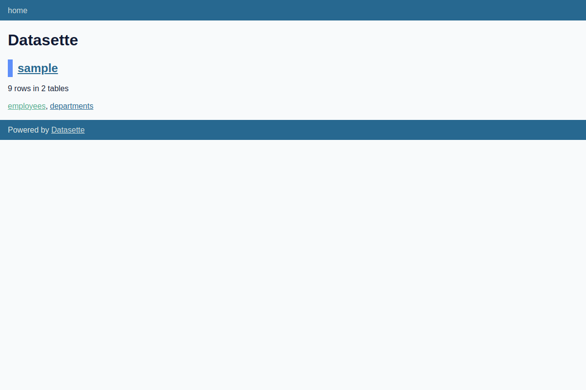
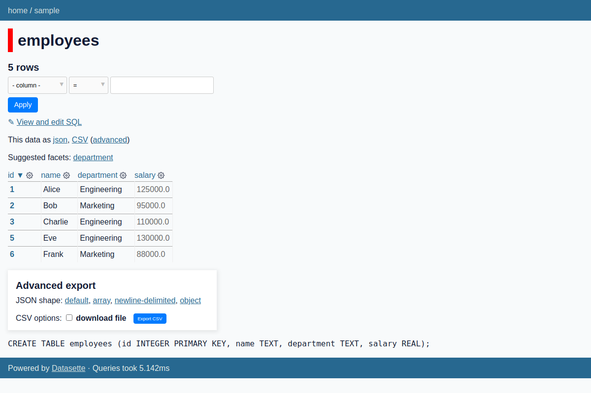
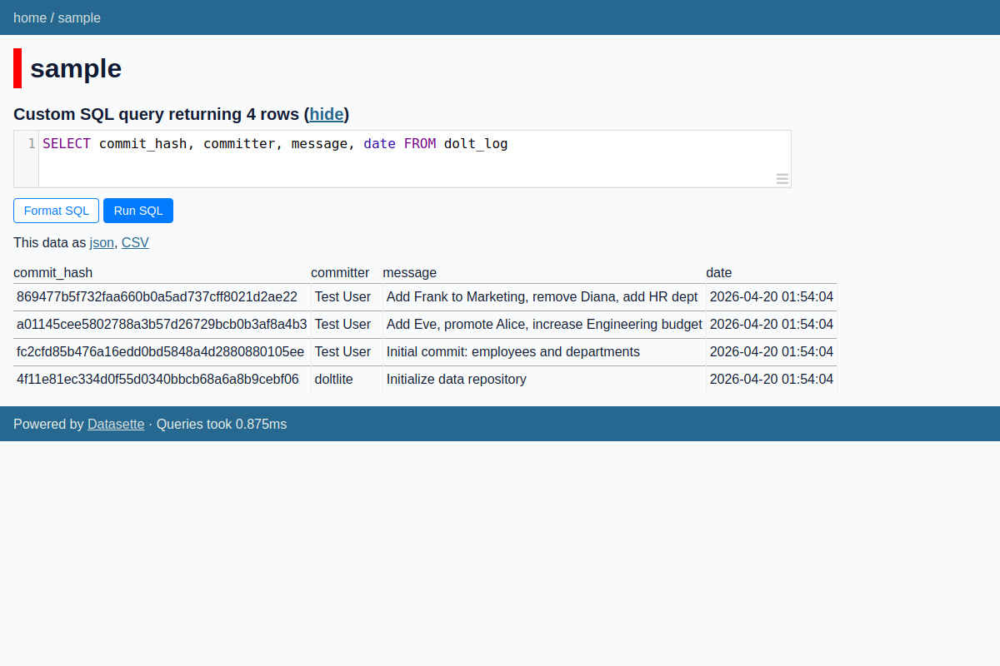
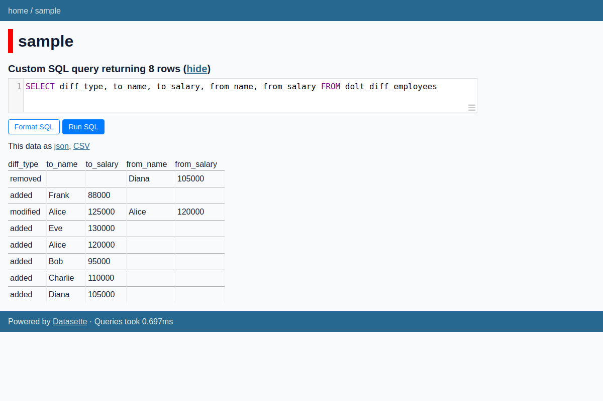
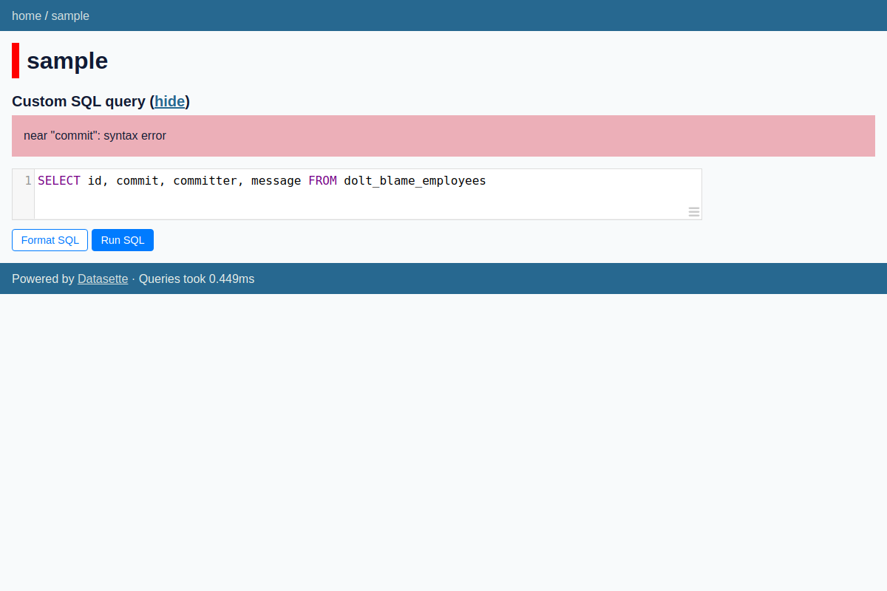
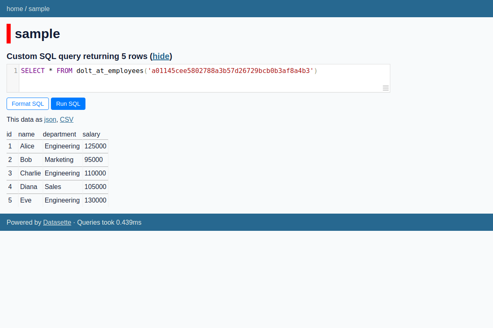
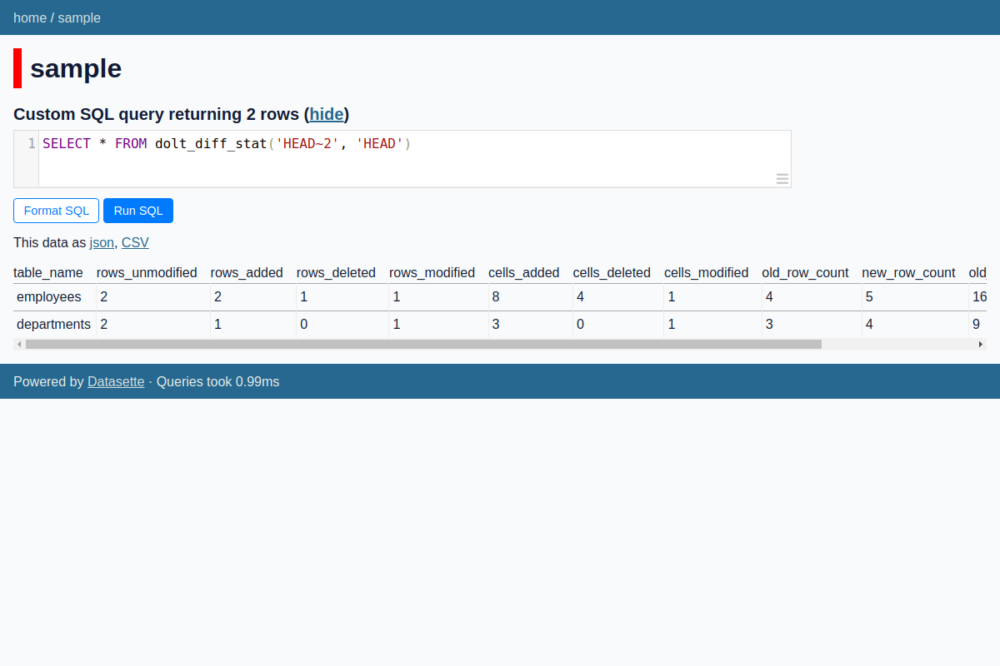

# Datasette + Doltlite: Version-Controlled SQL in Your Browser

*2026-04-20T02:04:45Z by Showboat 0.6.1*
<!-- showboat-id: 1eb64fcb-c263-4288-87b7-d1b158f14331 -->

This experiment tests whether [Datasette](https://github.com/simonw/datasette) — a tool for exploring SQLite databases via a web UI and JSON API — works with [Doltlite](https://github.com/dolthub/doltlite), a SQLite fork that adds Git-like version control (commits, branches, diffs, blame, time-travel queries).

**Key insight:** Doltlite is a drop-in replacement for SQLite at the C library level. By using `LD_PRELOAD` to swap in `libdoltlite.so`, Python's built-in `sqlite3` module (and therefore Datasette) uses the Doltlite engine transparently.

**Workarounds needed:**
1. Doltlite doesn't support SQLite's named shared-cache memory databases (`file:<name>?mode=memory&cache=shared`), which Datasette uses for its internal metadata database. A small monkey-patch redirects the internal database to a temp file.
2. Doltlite can segfault under concurrent multi-threaded access. Setting `num_sql_threads=1` in Datasette avoids this.

## Step 1: Datasette serves the Doltlite database

Datasette automatically discovers the user tables (employees, departments) and presents them in its web UI.



## Step 2: Browse tables with full Datasette UI

All standard Datasette features work: sorting, filtering, pagination, JSON/CSV export.



## Step 3: Query version control history via SQL

Doltlite's virtual tables are accessible through Datasette's SQL query interface. Here we query the commit log:



## Step 4: Row-level diffs between commits

The `dolt_diff_<table>` virtual table shows every INSERT, UPDATE, and DELETE ever committed:



## Step 5: Git blame for database rows

`dolt_blame_<table>` shows which commit last modified each row:



## Step 6: Time-travel queries

`dolt_at_<table>('commit_hash')` lets you query the table as it existed at any point in history:



## Step 7: Diff statistics

`dolt_diff_stat(from, to)` provides aggregate change counts between any two refs:



## Datasette JSON API with Doltlite

All Datasette API endpoints work with the Doltlite backend. Here are some examples using curl:

```bash
curl -s "http://127.0.0.1:8001/sample/employees.json?_shape=array" | python3 -m json.tool
```

```output
[
    {
        "id": 1,
        "name": "Alice",
        "department": "Engineering",
        "salary": 125000.0
    },
    {
        "id": 2,
        "name": "Bob",
        "department": "Marketing",
        "salary": 95000.0
    },
    {
        "id": 3,
        "name": "Charlie",
        "department": "Engineering",
        "salary": 110000.0
    },
    {
        "id": 5,
        "name": "Eve",
        "department": "Engineering",
        "salary": 130000.0
    },
    {
        "id": 6,
        "name": "Frank",
        "department": "Marketing",
        "salary": 88000.0
    }
]
```

### Commit history via JSON API

```bash
curl -s "http://127.0.0.1:8001/sample.json?sql=SELECT+commit_hash,+committer,+message+FROM+dolt_log&_shape=array" | python3 -m json.tool
```

```output
[
    {
        "commit_hash": "869477b5f732faa660b0a5ad737cff8021d2ae22",
        "committer": "Test User",
        "message": "Add Frank to Marketing, remove Diana, add HR dept"
    },
    {
        "commit_hash": "a01145cee5802788a3b57d26729bcb0b3af8a4b3",
        "committer": "Test User",
        "message": "Add Eve, promote Alice, increase Engineering budget"
    },
    {
        "commit_hash": "fc2cfd85b476a16edd0bd5848a4d2880880105ee",
        "committer": "Test User",
        "message": "Initial commit: employees and departments"
    },
    {
        "commit_hash": "4f11e81ec334d0f55d0340bbcb68a6a8b9cebf06",
        "committer": "doltlite",
        "message": "Initialize data repository"
    }
]
```

### Blame via JSON API

```bash
curl -s "http://127.0.0.1:8001/sample.json?sql=SELECT+id,+%22commit%22,+committer,+message+FROM+dolt_blame_employees&_shape=array" | python3 -m json.tool
```

```output
[
    {
        "id": 1,
        "commit": "a01145cee5802788a3b57d26729bcb0b3af8a4b3",
        "committer": "Test User",
        "message": "Add Eve, promote Alice, increase Engineering budget"
    },
    {
        "id": 2,
        "commit": "fc2cfd85b476a16edd0bd5848a4d2880880105ee",
        "committer": "Test User",
        "message": "Initial commit: employees and departments"
    },
    {
        "id": 3,
        "commit": "fc2cfd85b476a16edd0bd5848a4d2880880105ee",
        "committer": "Test User",
        "message": "Initial commit: employees and departments"
    },
    {
        "id": 5,
        "commit": "a01145cee5802788a3b57d26729bcb0b3af8a4b3",
        "committer": "Test User",
        "message": "Add Eve, promote Alice, increase Engineering budget"
    },
    {
        "id": 6,
        "commit": "869477b5f732faa660b0a5ad737cff8021d2ae22",
        "committer": "Test User",
        "message": "Add Frank to Marketing, remove Diana, add HR dept"
    }
]
```

## Conclusion

**Datasette works with Doltliteecho ___BEGIN___COMMAND_OUTPUT_MARKER___ ; PS1= ; PS2= ; unset HISTFILE ; EC=0 ; echo ___BEGIN___COMMAND_DONE_MARKER___0 ; }* With two minor workarounds (temp file for internal DB, single SQL thread), Datasette provides a full web UI and JSON API for exploring Doltlite's version-controlled databases. All key Doltlite features are accessible through Datasette's SQL query interface:

- ✅ **Table browsing** — standard Datasette table views work perfectly
- ✅ **Commit history** — `dolt_log` shows full commit history
- ✅ **Row-level diffs** — `dolt_diff_<table>` shows every change
- ✅ **Diff statistics** — `dolt_diff_stat(from, to)` provides change counts
- ✅ **Blame** — `dolt_blame_<table>` shows which commit last modified each row
- ✅ **Time-travel** — `dolt_at_<table>('commit')` queries historical snapshots
- ✅ **Branches** — `dolt_branches` lists all branches
- ✅ **JSON API** — all queries available programmatically
