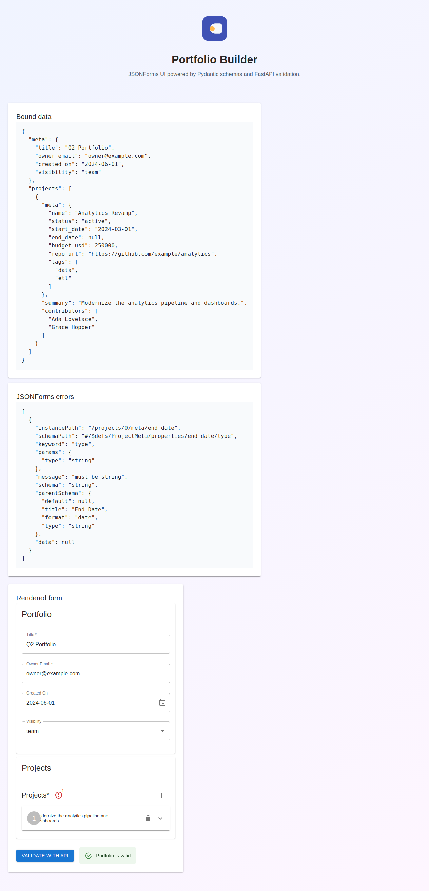
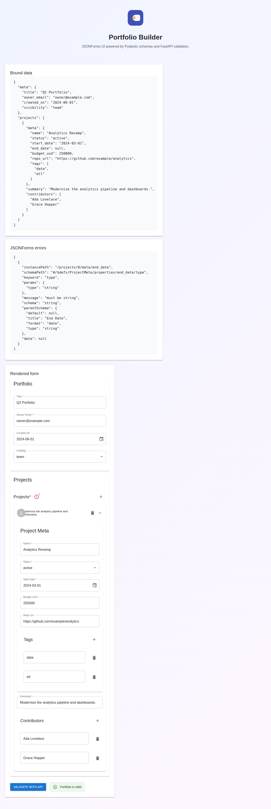

# JSONForms + Pydantic Integration Demo

*2026-02-12T12:03:53Z*

This demo showcases a full-stack integration between Pydantic models and JSONForms. The backend uses FastAPI with Pydantic for data validation, and the frontend uses React with JSONForms to dynamically generate forms from JSON Schema.

## Setup

The experiment lives in the pydantic-jsonforms-demo directory. It consists of two main components:
1. A FastAPI backend (app.py) that exposes JSON Schema and validation endpoints
2. A React + Vite frontend (jsonforms-client/) that renders forms using JSONForms Material UI renderers

## Starting the Backend

First, we'll start the FastAPI backend which provides the JSON Schema and validation endpoints.

```bash
cd ../pydantic-jsonforms-demo && uv run uvicorn app:app --port 8000 &
sleep 3
curl -s http://localhost:8000/schema | python3 -m json.tool | head -30
```

```output
INFO:     Started server process [4009]
INFO:     Waiting for application startup.
INFO:     Application startup complete.
ERROR:    [Errno 98] error while attempting to bind on address ('127.0.0.1', 8000): [errno 98] address already in use
INFO:     Waiting for application shutdown.
INFO:     Application shutdown complete.
{
    "$defs": {
        "PortfolioMeta": {
            "properties": {
                "title": {
                    "maxLength": 80,
                    "minLength": 3,
                    "title": "Title",
                    "type": "string"
                },
                "owner_email": {
                    "format": "email",
                    "title": "Owner Email",
                    "type": "string"
                },
                "created_on": {
                    "format": "date",
                    "title": "Created On",
                    "type": "string"
                },
                "visibility": {
                    "default": "private",
                    "enum": [
                        "private",
                        "team",
                        "public"
                    ],
                    "title": "Visibility",
                    "type": "string"
                }
```

## Starting the Frontend

Now let's start the React + Vite frontend which will fetch the schema from the backend and render a form using JSONForms.

## Using Rodney to Explore the Application

Rodney is a command-line Chrome automation tool. We'll use it to interact with the JSONForms application and capture screenshots.

Instead of using Rodney (which requires Chrome), we'll use Playwright to capture screenshots of the application in action.

Here's what the application looks like when it first loads with example data:


## Form Features

The JSONForms application includes several key features:

1. **Dynamic Form Generation**: The form is generated from the JSON Schema provided by the FastAPI backend
2. **Material UI Styling**: Uses Material UI renderers for professional-looking form controls
3. **Nested Objects**: Supports complex nested data structures (Portfolio → Projects → ProjectMeta)
4. **Arrays**: Projects can be added and removed dynamically
5. **Validation**: Both client-side (JSONForms) and server-side (FastAPI/Pydantic) validation
6. **Multiple Field Types**: Text inputs, email fields, date pickers, dropdowns, and number inputs

After clicking "Validate with API", the form data is sent to the FastAPI backend for validation:



The green success alert shows that the portfolio data passed both client-side and server-side validation.

## How It Works

### Backend (FastAPI + Pydantic)

The backend defines data models using Pydantic with built-in validation:
- Email format validation
- URL validation  
- Date ordering rules (end_date >= start_date)
- Conditional validation (completed projects must have end_date)
- String length constraints
- Array size limits

The FastAPI app exposes three endpoints:
1. `GET /schema` - Returns JSON Schema generated from Pydantic models
2. `GET /ui-schema` - Returns JSONForms UI Schema for layout
3. `POST /validate` - Validates submitted form data against Pydantic models

### Frontend (React + JSONForms)

The frontend fetches the schemas and uses JSONForms to:
1. Dynamically render form controls from the JSON Schema
2. Apply Material UI styling for a professional look
3. Handle user input and client-side validation
4. Send data to the backend for server-side validation
5. Display validation results to the user

## Nested Object Editing

Clicking on a project expands it to show all the nested fields including:
- Project metadata (name, status, dates, budget, repository URL)
- Tags (as an editable array)
- Summary
- Contributors (as an editable array)



Notice how the form dynamically shows:
- Date pickers for start/end dates
- Dropdown selectors for status and visibility
- Number inputs with validation for budget
- Arrays with add/remove buttons for tags and contributors

## Conclusion

This demo showcases a full-stack integration between Pydantic and JSONForms:

**Key Takeaways:**
1. Pydantic models serve as the single source of truth for validation
2. JSON Schema is automatically generated from Pydantic models
3. JSONForms dynamically creates forms from the schema
4. Validation happens both client-side (JSONForms) and server-side (Pydantic)
5. Material UI provides professional styling out of the box

**Benefits of This Approach:**
- **DRY Principle**: Define validation rules once in Pydantic
- **Type Safety**: Strong typing throughout the stack
- **Maintainability**: Changes to models automatically reflect in the UI
- **Flexibility**: Easy to add new fields or change validation rules
- **User Experience**: Rich form controls with proper validation feedback

This pattern is ideal for admin panels, configuration UIs, data entry forms, and any application where you need dynamic forms with complex validation requirements.
