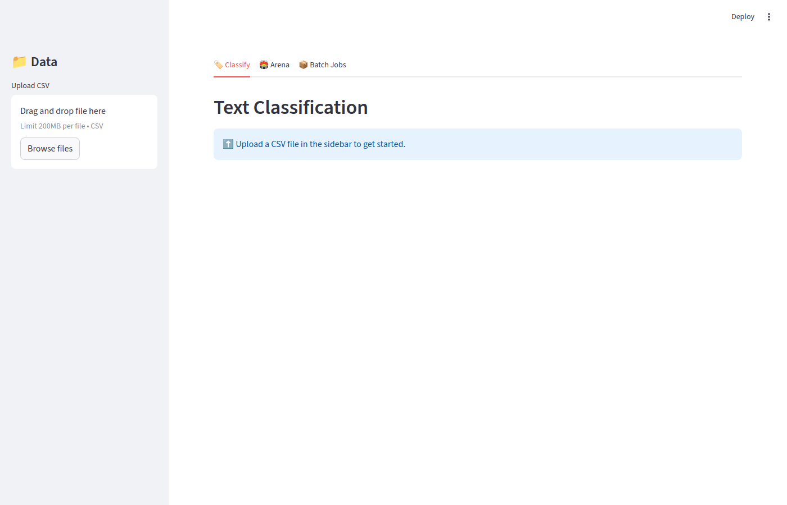
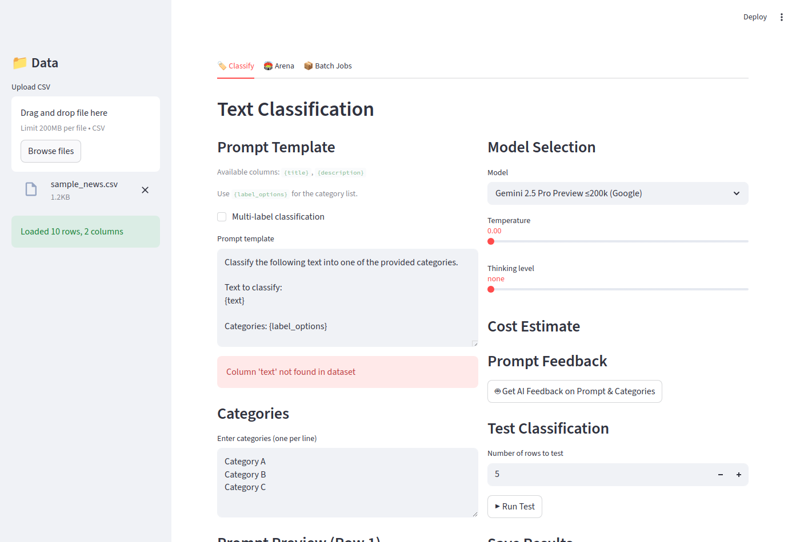
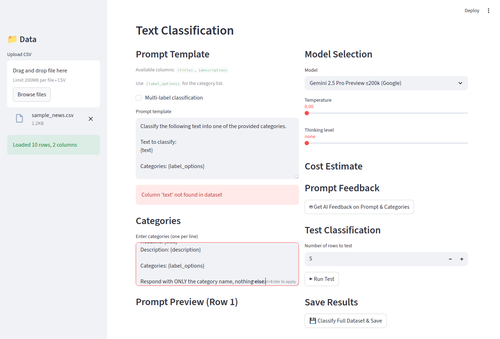
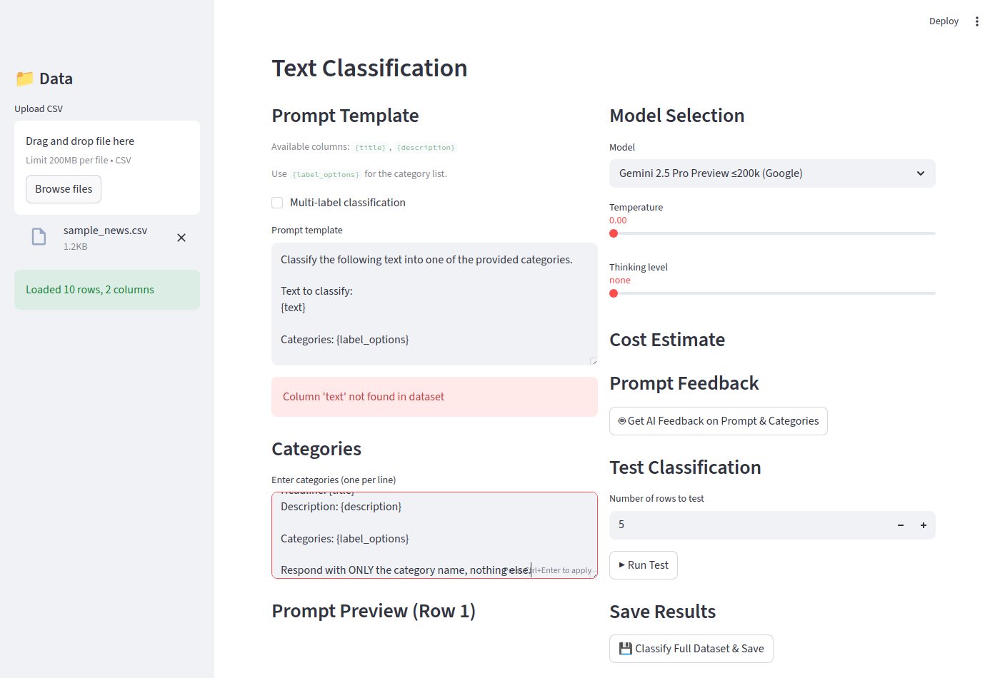

# LLM Classification App — Code Walkthrough

*2026-03-05T23:55:56Z by Showboat 0.6.1*
<!-- showboat-id: 23880ad1-bea4-4d1e-82c4-fef2073b0467 -->

This walkthrough traces the full codebase of the LLM Classification App — a Streamlit application that classifies text using LLMs via Vertex AI. The app supports Google Gemini, Anthropic Claude, and Meta Llama models, with features for single-label and multi-label classification, cost estimation, model arena comparisons, async batch processing, and AI-powered prompt feedback.

The architecture cleanly separates a Streamlit frontend (app.py) from a backend/ package that can be reused independently (e.g., as a FastAPI service).

## Project Structure

The top-level layout shows the clear separation between frontend, backend, tests, and data:

```bash
find . -not -path './.venv/*' -not -path './llm-prices/*' -not -path './__pycache__/*' -not -path './.git/*' -not -path './batch_state/*' -type f | sort | sed 's|^\./||'
```

```output
README.md
app.py
backend/__init__.py
backend/arena.py
backend/batch.py
backend/classifier.py
backend/feedback.py
backend/fuzzy_match.py
backend/models.py
backend/pricing.py
backend/prompt.py
notes.md
pyproject.toml
tests/test_batch.py
tests/test_fuzzy_match.py
tests/test_pricing.py
tests/test_prompt.py
walkthrough.md
```

The pyproject.toml lists the key dependencies. Notable choices:

- **litellm** — unified interface to all LLM providers, routing calls through Vertex AI
- **streamlit** — the frontend framework
- **rapidfuzz** — fast fuzzy string matching to normalize LLM outputs to known categories
- **pandas** — CSV loading and results assembly

```bash
cat pyproject.toml
```

```output
[project]
name = "llm-classification-app"
version = "0.1.0"
description = "LLM-based text classification app using Vertex AI"
requires-python = ">=3.12"
dependencies = [
    "google-cloud-aiplatform>=1.139.0",
    "google-cloud-bigquery>=3.40.1",
    "litellm>=1.82.0",
    "pandas>=2.3.3",
    "pytest>=9.0.2",
    "rapidfuzz>=3.14.3",
    "streamlit>=1.54.0",
]

[tool.pytest.ini_options]
pythonpath = ["."]
```

## backend/prompt.py — The Prompt Engine

This module defines how prompts are constructed from templates. It uses Python's built-in str.format() with named placeholders like {column_name} and the special {label_options} token.

The PromptTemplate dataclass:
1. **Parses** column placeholders from the template on creation
2. **Validates** that all used columns exist in the loaded DataFrame
3. **Renders** a complete prompt for each row, substituting column values and the category list
4. **Previews** a rendered prompt using the first row (for the UI)

Two default templates ship with the app — one for single-label and one for multi-label classification.

```bash
cat backend/prompt.py
```

```output
"""Prompt template handling with {col} placeholders and {label_options}."""

import re
from dataclasses import dataclass, field


DEFAULT_CLASSIFICATION_PROMPT = """Classify the following text into one of the provided categories.

Text to classify:
{text}

Categories: {label_options}

Respond with ONLY the category label, nothing else."""

DEFAULT_MULTI_LABEL_PROMPT = """Classify the following text into one or more of the provided categories.

Text to classify:
{text}

Categories: {label_options}

Respond with the applicable category labels separated by '|'. Include ONLY the labels, nothing else."""


@dataclass
class PromptTemplate:
    template: str
    columns_used: list[str] = field(default_factory=list)

    def __post_init__(self):
        self.columns_used = self.extract_columns()

    def extract_columns(self) -> list[str]:
        """Extract column placeholders from template, excluding label_options."""
        placeholders = re.findall(r"\{(\w+)\}", self.template)
        return [p for p in placeholders if p != "label_options"]

    def validate(self, available_columns: list[str]) -> list[str]:
        """Validate template against available columns. Returns list of errors."""
        errors = []
        for col in self.columns_used:
            if col not in available_columns:
                errors.append(f"Column '{col}' not found in dataset")
        if "{label_options}" not in self.template:
            errors.append("Template should include {label_options} placeholder")
        return errors

    def check_warnings(self, available_columns: list[str]) -> list[str]:
        """Check for warnings (non-fatal issues)."""
        warnings = []
        if "label_options" in available_columns:
            warnings.append(
                "⚠️ 'label_options' is both a column name and a special placeholder. "
                "The placeholder {label_options} will be replaced with categories, "
                "not the column value."
            )
        return warnings

    def render(
        self, row: dict, categories: list[str], multi_label: bool = False,
        delimiter: str = "|",
    ) -> str:
        """Render the prompt for a specific row."""
        label_str = ", ".join(categories)
        values = {"label_options": label_str}
        for col in self.columns_used:
            values[col] = str(row.get(col, f"[missing:{col}]"))
        try:
            return self.template.format(**values)
        except KeyError as e:
            return f"Error rendering prompt: missing key {e}"

    def preview(
        self, first_row: dict, categories: list[str], multi_label: bool = False,
        delimiter: str = "|",
    ) -> str:
        """Preview the prompt using the first row of data."""
        return self.render(first_row, categories, multi_label, delimiter)


FEEDBACK_PROMPT = """You are an expert in prompt engineering and text classification. 
Please review the following classification prompt and categories, then provide feedback.

PROMPT TEMPLATE:
{prompt}

CATEGORIES:
{categories}

CLASSIFICATION TYPE: {classification_type}

Please evaluate and provide feedback on:
1. **Clarity**: Is the prompt clear and unambiguous?
2. **Category Overlap**: Are any categories overlapping or ambiguous?
3. **Missing Categories**: Is an "Other" or catch-all category needed?
4. **Prompt Quality**: Any suggestions to improve classification accuracy?
5. **Category Count**: Are there too many or too few categories?
6. **RAG Recommendation**: If the prompt and categories are very long (combined >2000 tokens), recommend using RAG-based classification instead.

Provide specific, actionable suggestions."""
```

```python3

import sys
sys.path.insert(0, '.')
from backend.prompt import PromptTemplate

template = PromptTemplate('Classify the {text} into: {label_options}')
print('Columns used:', template.columns_used)

rendered = template.render(
    row={'text': 'I love this product!'},
    categories=['Positive', 'Negative', 'Neutral'],
)
print()
print('Rendered prompt:')
print(rendered)

```

```output
Columns used: ['text']

Rendered prompt:
Classify the I love this product! into: Positive, Negative, Neutral
```

## backend/fuzzy_match.py — Normalising LLM Output

LLMs don't always respond with the exact category label. They might add punctuation, capitalise differently, or add surrounding text. fuzzy_match_label() handles this with a two-step approach:

1. **Exact match** first (case-insensitive) — fastest path
2. **Fuzzy match** (rapidfuzz fuzz.ratio) with a configurable score threshold (default 60)

For multi-label classification, fuzzy_match_multi_label() splits the response on the delimiter and fuzzy-matches each fragment independently.

find_safe_delimiter() is a small utility that ensures the multi-label separator (| by default) doesn't appear in any category name — preventing ambiguous splits.

```bash
cat backend/fuzzy_match.py
```

```output
"""Fuzzy matching for classification results against known categories."""

from rapidfuzz import fuzz, process


def fuzzy_match_label(
    prediction: str,
    categories: list[str],
    threshold: int = 60,
) -> str | None:
    """Match a prediction to the closest category using fuzzy matching.

    Returns the matched category or None if no match above threshold.
    """
    if not prediction or not categories:
        return None

    prediction = prediction.strip()

    # Exact match first (case-insensitive)
    for cat in categories:
        if prediction.lower() == cat.lower():
            return cat

    # Fuzzy match
    result = process.extractOne(
        prediction, categories, scorer=fuzz.ratio, score_cutoff=threshold
    )
    if result:
        return result[0]
    return None


def fuzzy_match_multi_label(
    prediction: str,
    categories: list[str],
    delimiter: str = "|",
    threshold: int = 60,
) -> list[str]:
    """Match multi-label predictions to categories.

    Splits prediction by delimiter and fuzzy-matches each part.
    """
    if not prediction:
        return []

    parts = [p.strip() for p in prediction.split(delimiter) if p.strip()]
    matched = []
    for part in parts:
        match = fuzzy_match_label(part, categories, threshold)
        if match and match not in matched:
            matched.append(match)
    return matched


def find_safe_delimiter(categories: list[str]) -> str:
    """Find a delimiter that doesn't appear in any category label."""
    candidates = ["|", "||", ";;", "###", "^^^"]
    for delim in candidates:
        if not any(delim in cat for cat in categories):
            return delim
    return "|||"
```

```bash
.venv/bin/python3 -c "
import sys
sys.path.insert(0, '.')
from backend.fuzzy_match import fuzzy_match_label, fuzzy_match_multi_label, find_safe_delimiter

categories = ['Technology', 'Sports', 'Politics', 'Entertainment']

print('Exact match:')
print(repr(fuzzy_match_label('Sports', categories)))

print()
print('Fuzzy match (imperfect LLM output):')
print(repr(fuzzy_match_label('sport', categories)))
print(repr(fuzzy_match_label('Tech & Science', categories)))
print(repr(fuzzy_match_label('completely unrelated', categories)))

print()
print('Multi-label split and match:')
print(fuzzy_match_multi_label('Technology | Entrtainment', categories))

print()
print('Safe delimiter when | is in a category name:')
pipe_cats = ['A|B', 'C', 'D']
print(repr(find_safe_delimiter(pipe_cats)))
"
```

```output
Exact match:
'Sports'

Fuzzy match (imperfect LLM output):
'Sports'
None
None

Multi-label split and match:
['Technology', 'Entertainment']

Safe delimiter when | is in a category name:
'||'
```

## backend/pricing.py — Cost Estimation

The pricing module reads JSON files from a git submodule (simonw/llm-prices) and builds a catalogue of ModelPrice objects. Each price has:

- input_per_mtok / output_per_mtok — dollar cost per million tokens
- input_cached_per_mtok — optional cached-prompt discount (e.g. Gemini supports this)

get_vertex_models() returns all models available on Vertex AI, mapping model IDs to Vertex AI endpoint paths:
- **Google Gemini** — used directly (vertex_ai/gemini-2.5-pro etc.)
- **Anthropic Claude** — mapped to versioned Vertex IDs (claude-3-7-sonnet@20250219)
- **Meta Llama** — hardcoded Vertex Model Garden paths with approximate pricing

estimate_dataset_cost() projects cost for a full dataset from an average token count and the number of rows.

```bash
cat backend/pricing.py
```

```output
"""Load and query pricing data from the llm-prices submodule."""

import json
import os
from dataclasses import dataclass
from pathlib import Path


@dataclass
class ModelPrice:
    model_id: str
    name: str
    vendor: str
    input_per_mtok: float  # $ per million tokens
    output_per_mtok: float
    input_cached_per_mtok: float | None = None

    @property
    def input_per_token(self) -> float:
        return self.input_per_mtok / 1_000_000

    @property
    def output_per_token(self) -> float:
        return self.output_per_mtok / 1_000_000

    def estimate_cost(
        self, input_tokens: int, output_tokens: int, cached_input_tokens: int = 0
    ) -> float:
        cost = (input_tokens - cached_input_tokens) * self.input_per_token
        cost += output_tokens * self.output_per_token
        if cached_input_tokens and self.input_cached_per_mtok is not None:
            cost += cached_input_tokens * (self.input_cached_per_mtok / 1_000_000)
        return cost


# Map from vendor names used in llm-prices to Vertex AI model prefixes
VERTEX_MODEL_MAP: dict[str, dict[str, str]] = {
    "google": {},  # Gemini models use their IDs directly on Vertex
    "anthropic": {  # Claude models on Vertex use a specific format
        "claude-3.7-sonnet": "claude-3-7-sonnet@20250219",
        "claude-3.5-sonnet": "claude-3-5-sonnet-v2@20241022",
        "claude-3-opus": "claude-3-opus@20240229",
        "claude-3-haiku": "claude-3-haiku@20240307",
        "claude-3.5-haiku": "claude-3-5-haiku@20241022",
        "claude-sonnet-4.5": "claude-sonnet-4-5@20250514",
        "claude-opus-4": "claude-opus-4@20250514",
    },
}


def _prices_dir() -> Path:
    return Path(__file__).parent.parent / "llm-prices" / "data"


def load_all_prices() -> dict[str, ModelPrice]:
    """Load pricing for all models, keyed by llm-prices model id."""
    prices: dict[str, ModelPrice] = {}
    data_dir = _prices_dir()
    if not data_dir.exists():
        return prices
    for json_file in sorted(data_dir.glob("*.json")):
        try:
            data = json.loads(json_file.read_text())
        except (json.JSONDecodeError, OSError):
            continue
        vendor = data.get("vendor", json_file.stem)
        for model in data.get("models", []):
            model_id = model["id"]
            history = model.get("price_history", [])
            if not history:
                continue
            latest = history[0]
            prices[model_id] = ModelPrice(
                model_id=model_id,
                name=model.get("name", model_id),
                vendor=vendor,
                input_per_mtok=latest.get("input", 0),
                output_per_mtok=latest.get("output", 0),
                input_cached_per_mtok=latest.get("input_cached"),
            )
    return prices


def get_vertex_models() -> list[dict]:
    """Return models available on Vertex AI with pricing info."""
    all_prices = load_all_prices()
    models = []

    # Google models (Gemini) - available directly on Vertex
    for mid, price in all_prices.items():
        if price.vendor == "google" and "gemini" in mid:
            models.append({
                "id": mid,
                "vertex_id": f"vertex_ai/{mid}",
                "name": price.name,
                "vendor": "Google",
                "price": price,
            })

    # Anthropic models on Vertex AI
    for llm_id, vertex_id in VERTEX_MODEL_MAP.get("anthropic", {}).items():
        if llm_id in all_prices:
            price = all_prices[llm_id]
            models.append({
                "id": llm_id,
                "vertex_id": f"vertex_ai/{vertex_id}",
                "name": price.name,
                "vendor": "Anthropic",
                "price": price,
            })

    # Llama models on Vertex (Model Garden)
    llama_models = [
        {
            "id": "llama-3.1-405b",
            "vertex_id": "vertex_ai/meta/llama-3.1-405b-instruct-maas",
            "name": "Llama 3.1 405B",
            "vendor": "Meta",
        },
        {
            "id": "llama-3.1-70b",
            "vertex_id": "vertex_ai/meta/llama-3.1-70b-instruct-maas",
            "name": "Llama 3.1 70B",
            "vendor": "Meta",
        },
        {
            "id": "llama-3.1-8b",
            "vertex_id": "vertex_ai/meta/llama-3.1-8b-instruct-maas",
            "name": "Llama 3.1 8B",
            "vendor": "Meta",
        },
    ]
    # Llama pricing on Vertex (approximate, per 1M tokens)
    llama_prices = {
        "llama-3.1-405b": (5.33, 16.0),
        "llama-3.1-70b": (2.56, 3.58),
        "llama-3.1-8b": (0.20, 0.20),
    }
    for m in llama_models:
        inp, out = llama_prices.get(m["id"], (0, 0))
        m["price"] = ModelPrice(
            model_id=m["id"],
            name=m["name"],
            vendor="Meta",
            input_per_mtok=inp,
            output_per_mtok=out,
        )
        models.append(m)

    return models


def estimate_dataset_cost(
    price: ModelPrice,
    avg_input_tokens: float,
    avg_output_tokens: float,
    num_rows: int,
    cached_input_tokens: int = 0,
) -> float:
    """Estimate total cost for classifying a full dataset."""
    per_row = price.estimate_cost(
        int(avg_input_tokens), int(avg_output_tokens), cached_input_tokens
    )
    return per_row * num_rows


def format_cost(cost: float) -> str:
    if cost < 0.01:
        return f"${cost:.4f}"
    return f"${cost:.2f}"
```

```bash
.venv/bin/python3 -c "
import sys
sys.path.insert(0, '.')
from backend.pricing import get_vertex_models, estimate_dataset_cost, format_cost

models = get_vertex_models()
print(f'Total models available: {len(models)}')
print()
print('Sample models:')
for m in models[:8]:
    p = m.get('price')
    if p:
        print(f'  {m[\"name\"]:<32} ({m[\"vendor\"]:<10}) input \${p.input_per_mtok}/Mtok, output \${p.output_per_mtok}/Mtok')

# Cost estimate demo
gemini_flash = next((m for m in models if 'flash' in m['id'].lower() and '2.0' in m['id']), models[0])
cost = estimate_dataset_cost(gemini_flash['price'], avg_input_tokens=200, avg_output_tokens=10, num_rows=10000)
print()
print(f'Estimate: 10,000 rows with {gemini_flash[\"name\"]} (200 input, 10 output tokens each):')
print(f'  => {format_cost(cost)}')
"
```

```output
Total models available: 30

Sample models:
  Gemini 2.5 Pro Preview ≤200k     (Google    ) input $1.25/Mtok, output $10/Mtok
  Gemini 2.5 Pro Preview >200k     (Google    ) input $2.5/Mtok, output $15/Mtok
  Gemini 2.0 Flash Lite            (Google    ) input $0.075/Mtok, output $0.3/Mtok
  Gemini 2.0 Flash                 (Google    ) input $0.1/Mtok, output $0.4/Mtok
  Gemini 1.5 Flash ≤128k           (Google    ) input $0.075/Mtok, output $0.3/Mtok
  Gemini 1.5 Flash >128k           (Google    ) input $0.15/Mtok, output $0.6/Mtok
  Gemini 1.5 Flash-8B ≤128k        (Google    ) input $0.0375/Mtok, output $0.15/Mtok
  Gemini 1.5 Flash-8B >128k        (Google    ) input $0.075/Mtok, output $0.3/Mtok

Estimate: 10,000 rows with Gemini 2.0 Flash Lite (200 input, 10 output tokens each):
  => $0.18
```

## backend/models.py — Model Configuration

ModelConfig is a dataclass that holds everything needed to invoke a model through litellm. Its to_litellm_kwargs() method is the single point where model parameters are translated into the dict litellm.completion() accepts.

Thinking/reasoning is handled per-vendor:
- **Gemini** — uses thinking_config with budget_tokens
- **Claude** — uses thinking with type=enabled and budget_tokens
- **Llama** — no thinking support

The three helper functions (get_available_models, get_model_display_options, create_model_config) give the UI a clean interface without needing to know about pricing or Vertex ID formats.

```bash
cat backend/models.py
```

```output
"""Model configuration and Vertex AI integration via litellm."""

from dataclasses import dataclass, field
from backend.pricing import get_vertex_models, ModelPrice


@dataclass
class ModelConfig:
    """Configuration for a model run."""
    vertex_id: str
    display_name: str
    vendor: str
    price: ModelPrice | None = None
    temperature: float = 0.0
    max_tokens: int = 4096
    thinking_level: str | None = None  # "low", "medium", "high" for supported models
    extra_params: dict = field(default_factory=dict)

    def to_litellm_kwargs(self) -> dict:
        """Convert to kwargs for litellm.completion()."""
        kwargs = {
            "model": self.vertex_id,
            "temperature": self.temperature,
            "max_tokens": self.max_tokens,
        }
        # Thinking budget / effort for models that support it
        if self.thinking_level:
            if "gemini" in self.vertex_id.lower():
                # Gemini uses thinking_config
                budget_map = {"low": 1024, "medium": 8192, "high": 32768}
                kwargs["thinking"] = {
                    "type": "enabled",
                    "budget_tokens": budget_map.get(self.thinking_level, 8192),
                }
            elif "claude" in self.vertex_id.lower():
                # Claude uses extended thinking
                budget_map = {"low": 2048, "medium": 10000, "high": 32000}
                kwargs["thinking"] = {
                    "type": "enabled",
                    "budget_tokens": budget_map.get(self.thinking_level, 10000),
                }
        kwargs.update(self.extra_params)
        return kwargs


# Thinking level options per vendor
THINKING_LEVELS = {
    "Google": ["none", "low", "medium", "high"],
    "Anthropic": ["none", "low", "medium", "high"],
    "Meta": [],  # Llama doesn't support thinking
}


def get_available_models() -> list[dict]:
    """Get all available models with their configurations."""
    return get_vertex_models()


def get_model_display_options() -> list[str]:
    """Get display-friendly model names for UI selection."""
    models = get_available_models()
    return [f"{m['name']} ({m['vendor']})" for m in models]


def get_model_by_display_name(display_name: str) -> dict | None:
    """Find a model by its display name."""
    models = get_available_models()
    for m in models:
        if f"{m['name']} ({m['vendor']})" == display_name:
            return m
    return None


def create_model_config(
    model_info: dict,
    temperature: float = 0.0,
    max_tokens: int = 4096,
    thinking_level: str | None = None,
) -> ModelConfig:
    """Create a ModelConfig from model info dict."""
    return ModelConfig(
        vertex_id=model_info["vertex_id"],
        display_name=model_info["name"],
        vendor=model_info["vendor"],
        price=model_info.get("price"),
        temperature=temperature,
        max_tokens=max_tokens,
        thinking_level=thinking_level if thinking_level != "none" else None,
    )
```

```bash
.venv/bin/python3 -c "
import sys
sys.path.insert(0, '.')
from backend.models import create_model_config, get_available_models

models = get_available_models()
gemini = next(m for m in models if 'gemini-2.0-flash' in m['id'] and 'lite' not in m['id'])
print('Model info from pricing module:')
print(f'  id:        {gemini[\"id\"]}')
print(f'  vertex_id: {gemini[\"vertex_id\"]}')
print(f'  name:      {gemini[\"name\"]}')
print(f'  vendor:    {gemini[\"vendor\"]}')

print()
config = create_model_config(gemini, temperature=0.0, thinking_level='medium')
print('ModelConfig.to_litellm_kwargs() with medium thinking:')
import json
print(json.dumps(config.to_litellm_kwargs(), indent=2))
"
```

```output
Model info from pricing module:
  id:        gemini-2.0-flash
  vertex_id: vertex_ai/gemini-2.0-flash
  name:      Gemini 2.0 Flash
  vendor:    Google

ModelConfig.to_litellm_kwargs() with medium thinking:
{
  "model": "vertex_ai/gemini-2.0-flash",
  "temperature": 0.0,
  "max_tokens": 4096,
  "thinking": {
    "type": "enabled",
    "budget_tokens": 8192
  }
}
```

## backend/classifier.py — The Classification Engine

This is the core of the app. It orchestrates LLM calls for one row or many:

**classify_single_row()** — calls litellm.completion() with the rendered prompt, extracts the raw text response, then routes through fuzzy_match_label() (single) or fuzzy_match_multi_label() (multi), returning a ClassificationResult dataclass with the normalised label plus token usage.

**classify_rows()** — iterates over a DataFrame, rendering the prompt for each row and calling classify_single_row(). A progress_callback(current, total) is called after each row so the UI can update a progress bar.

**estimate_tokens_from_sample()** — uses litellm.token_counter() on a 5-row sample to compute average input token count, then projects that to the full dataset for cost estimation.

**apply_results_to_dataframe()** — merges ClassificationResult objects back into a copy of the DataFrame, adding classification and raw_response columns.

```bash
cat backend/classifier.py
```

```output
"""Classification logic: single-label, multi-label, token counting."""

import json
import time
from dataclasses import dataclass

import litellm
import pandas as pd

from backend.fuzzy_match import fuzzy_match_label, fuzzy_match_multi_label, find_safe_delimiter
from backend.models import ModelConfig
from backend.prompt import PromptTemplate


@dataclass
class ClassificationResult:
    row_index: int
    raw_response: str
    matched_label: str | list[str]
    input_tokens: int
    output_tokens: int


def classify_single_row(
    model_config: ModelConfig,
    prompt_text: str,
    categories: list[str],
    multi_label: bool = False,
    delimiter: str = "|",
) -> ClassificationResult:
    """Classify a single row using litellm."""
    kwargs = model_config.to_litellm_kwargs()

    response = litellm.completion(
        messages=[{"role": "user", "content": prompt_text}],
        **kwargs,
    )

    raw = response.choices[0].message.content.strip()
    usage = response.usage

    if multi_label:
        matched = fuzzy_match_multi_label(raw, categories, delimiter)
    else:
        matched = fuzzy_match_label(raw, categories) or raw

    return ClassificationResult(
        row_index=0,
        raw_response=raw,
        matched_label=matched,
        input_tokens=usage.prompt_tokens if usage else 0,
        output_tokens=usage.completion_tokens if usage else 0,
    )


def classify_rows(
    df: pd.DataFrame,
    model_config: ModelConfig,
    prompt_template: PromptTemplate,
    categories: list[str],
    multi_label: bool = False,
    delimiter: str = "|",
    max_rows: int | None = None,
    progress_callback=None,
) -> list[ClassificationResult]:
    """Classify multiple rows with progress tracking.

    Args:
        df: DataFrame to classify
        model_config: Model configuration
        prompt_template: Prompt template with placeholders
        categories: Classification categories
        multi_label: Whether to allow multiple labels
        delimiter: Delimiter for multi-label output
        max_rows: Limit number of rows (for testing)
        progress_callback: Callable(current, total) for progress updates
    """
    rows_to_process = df.head(max_rows) if max_rows else df
    total = len(rows_to_process)
    results = []

    for idx, (_, row) in enumerate(rows_to_process.iterrows()):
        prompt_text = prompt_template.render(
            row.to_dict(), categories, multi_label, delimiter
        )

        result = classify_single_row(
            model_config, prompt_text, categories, multi_label, delimiter
        )
        result.row_index = idx

        results.append(result)

        if progress_callback:
            progress_callback(idx + 1, total)

    return results


def count_tokens_for_prompt(prompt_text: str, model_id: str) -> int:
    """Estimate token count for a prompt using litellm.

    Falls back to character-based estimation (~4 chars/token) if
    litellm token counting fails (e.g., unsupported model, missing tokenizer).
    """
    try:
        return litellm.token_counter(model=model_id, text=prompt_text)
    except Exception:
        return len(prompt_text) // 4


def estimate_tokens_from_sample(
    df: pd.DataFrame,
    prompt_template: PromptTemplate,
    categories: list[str],
    model_id: str,
    sample_size: int = 5,
) -> dict:
    """Estimate average token counts from a sample of rows."""
    sample = df.head(min(sample_size, len(df)))
    token_counts = []

    for _, row in sample.iterrows():
        prompt_text = prompt_template.render(row.to_dict(), categories)
        tokens = count_tokens_for_prompt(prompt_text, model_id)
        token_counts.append(tokens)

    avg_input = sum(token_counts) / len(token_counts) if token_counts else 0
    return {
        "avg_input_tokens": avg_input,
        "sample_counts": token_counts,
        "total_rows": len(df),
        "estimated_total_input_tokens": avg_input * len(df),
    }


def apply_results_to_dataframe(
    df: pd.DataFrame,
    results: list[ClassificationResult],
    column_name: str = "classification",
    multi_label: bool = False,
    delimiter: str = "|",
) -> pd.DataFrame:
    """Apply classification results to a copy of the DataFrame."""
    df_out = df.copy()
    df_out[column_name] = None
    df_out["raw_response"] = None

    for result in results:
        if result.row_index < len(df_out):
            if multi_label and isinstance(result.matched_label, list):
                df_out.at[result.row_index, column_name] = delimiter.join(
                    result.matched_label
                )
            else:
                df_out.at[result.row_index, column_name] = result.matched_label
            df_out.at[result.row_index, "raw_response"] = result.raw_response

    return df_out
```

## backend/feedback.py — AI Prompt Review

A thin wrapper that sends the user's prompt template and categories to an LLM for feedback. It uses the FEEDBACK_PROMPT template from prompt.py (defined there to keep all prompt text together), filling in the template text, categories list, and classification type (single vs multi-label).

The feedback covers: clarity, category overlap, missing catch-all, prompt quality suggestions, category count, and a RAG recommendation if the prompt is very long.

```bash
cat backend/feedback.py
```

```output
"""AI feedback on prompts and categories."""

import litellm
from backend.models import ModelConfig
from backend.prompt import FEEDBACK_PROMPT


def get_prompt_feedback(
    model_config: ModelConfig,
    prompt_template: str,
    categories: list[str],
    multi_label: bool = False,
) -> str:
    """Get AI feedback on the classification prompt and categories."""
    classification_type = "multi-label" if multi_label else "single-label"
    categories_str = "\n".join(f"- {cat}" for cat in categories)

    feedback_prompt = FEEDBACK_PROMPT.format(
        prompt=prompt_template,
        categories=categories_str,
        classification_type=classification_type,
    )

    kwargs = model_config.to_litellm_kwargs()
    # Override max_tokens for feedback - needs room for detailed response
    kwargs["max_tokens"] = 4096

    response = litellm.completion(
        messages=[{"role": "user", "content": feedback_prompt}],
        **kwargs,
    )

    return response.choices[0].message.content.strip()
```

## backend/arena.py — Model Arena

Arena mode runs the same classification task across multiple model configurations simultaneously, then allows a judge model to evaluate quality.

**run_arena()** — iterates over a list of ModelConfig objects, calling classify_rows() for each. Progress is normalised across all models so the UI shows a single unified progress bar. Results are stored per-model key (which includes the temperature and thinking level so the same model with different params is distinguishable).

**judge_arena_results()** — builds a classification summary showing each row's text and each model's classification side by side (no categories included, to avoid biasing the judge). Sends this to a judge model with a structured prompt requesting JSON output: which model was best for each row and why.

**export_arena_data()** — flattens the per-model results into a wide DataFrame (one column per model) for CSV export.

```bash
cat backend/arena.py
```

```output
"""Arena mode: compare multiple models and judge results."""

import pandas as pd
import litellm

from backend.classifier import classify_rows, ClassificationResult
from backend.models import ModelConfig
from backend.prompt import PromptTemplate
from backend.pricing import estimate_dataset_cost, format_cost


DEFAULT_JUDGE_PROMPT = """You are an expert judge evaluating text classification quality.

For each row, multiple models have classified a piece of text. Evaluate which model 
produced the best classification.

Consider:
1. Accuracy: Does the classification match the text content?
2. Specificity: Is the classification appropriately specific?
3. Consistency: Is the classification style consistent?

For each row, provide:
- The best model name
- A brief justification (1 sentence)

Respond in JSON format:
{{"evaluations": [{{"row": 0, "best_model": "model_name", "reason": "..."}}]}}

Here are the classifications to evaluate:

{classifications}"""


def run_arena(
    df: pd.DataFrame,
    model_configs: list[ModelConfig],
    prompt_template: PromptTemplate,
    categories: list[str],
    multi_label: bool = False,
    delimiter: str = "|",
    max_rows: int = 10,
    progress_callback=None,
) -> dict:
    """Run classification with multiple models for comparison.

    Returns a dict with results from each model and aggregated data.
    """
    all_results = {}
    token_stats = {}
    total_models = len(model_configs)

    for model_idx, config in enumerate(model_configs):
        model_key = f"{config.display_name} (T={config.temperature}"
        if config.thinking_level:
            model_key += f", think={config.thinking_level}"
        model_key += ")"

        def model_progress(current, total):
            if progress_callback:
                overall = (model_idx * max_rows + current) / (total_models * max_rows)
                progress_callback(overall)

        results = classify_rows(
            df=df,
            model_config=config,
            prompt_template=prompt_template,
            categories=categories,
            multi_label=multi_label,
            delimiter=delimiter,
            max_rows=max_rows,
            progress_callback=model_progress,
        )

        all_results[model_key] = results

        # Calculate token stats
        total_input = sum(r.input_tokens for r in results)
        total_output = sum(r.output_tokens for r in results)
        avg_input = total_input / len(results) if results else 0
        avg_output = total_output / len(results) if results else 0

        token_stats[model_key] = {
            "avg_input_tokens": avg_input,
            "avg_output_tokens": avg_output,
            "total_input_tokens": total_input,
            "total_output_tokens": total_output,
            "sample_cost": config.price.estimate_cost(total_input, total_output)
            if config.price
            else 0,
            "estimated_full_cost": estimate_dataset_cost(
                config.price, avg_input, avg_output, len(df)
            )
            if config.price
            else 0,
        }

    return {
        "results": all_results,
        "token_stats": token_stats,
        "num_rows_tested": min(max_rows, len(df)),
    }


def judge_arena_results(
    arena_results: dict,
    df: pd.DataFrame,
    prompt_template: PromptTemplate,
    categories: list[str],
    judge_config: ModelConfig,
    judge_prompt: str = DEFAULT_JUDGE_PROMPT,
    max_rows: int = 10,
) -> str:
    """Use a judge model to evaluate arena results.

    Categories are excluded from the judge prompt to avoid biasing
    the evaluation — the judge should assess quality based solely
    on how well each classification matches the source text.
    """
    # Build classification summary for judge
    classifications_text = ""
    rows_to_show = min(max_rows, len(df))

    for row_idx in range(rows_to_show):
        row = df.iloc[row_idx]
        # Show the text columns used in the prompt
        cols_used = prompt_template.columns_used
        text_preview = " | ".join(
            f"{col}: {row.get(col, 'N/A')}" for col in cols_used
        )
        classifications_text += f"\n--- Row {row_idx} ---\n"
        classifications_text += f"Text: {text_preview}\n"

        for model_key, results in arena_results["results"].items():
            if row_idx < len(results):
                label = results[row_idx].matched_label
                if isinstance(label, list):
                    label = " | ".join(label)
                classifications_text += f"  {model_key}: {label}\n"

    final_prompt = judge_prompt.format(classifications=classifications_text)

    kwargs = judge_config.to_litellm_kwargs()
    kwargs["max_tokens"] = 4096

    response = litellm.completion(
        messages=[{"role": "user", "content": final_prompt}],
        **kwargs,
    )

    return response.choices[0].message.content.strip()


def export_arena_data(
    arena_results: dict,
    df: pd.DataFrame,
    prompt_template: PromptTemplate,
    max_rows: int = 10,
) -> pd.DataFrame:
    """Export arena comparison data as a DataFrame."""
    rows = []
    rows_to_export = min(max_rows, len(df))

    for row_idx in range(rows_to_export):
        row_data = {}
        # Include columns used in the prompt
        for col in prompt_template.columns_used:
            row_data[col] = df.iloc[row_idx].get(col, "")

        # Add each model's classification
        for model_key, results in arena_results["results"].items():
            if row_idx < len(results):
                label = results[row_idx].matched_label
                if isinstance(label, list):
                    label = " | ".join(label)
                row_data[f"classification_{model_key}"] = label
                row_data[f"raw_{model_key}"] = results[row_idx].raw_response

        rows.append(row_data)

    return pd.DataFrame(rows)
```

## backend/batch.py — Async Batch Processing

Batch processing lets you submit thousands of rows as a single job and collect results hours later, at significantly lower cost on Vertex AI.

**State persistence**: Each submitted batch gets a JSON file in batch_state/. This means if the Streamlit app restarts, the batch IDs aren't lost — they can be checked and retrieved from the tracking UI.

**prepare_batch_requests()** — converts a DataFrame to a list of JSONL request dicts in the OpenAI Batch API format (custom_id, method, url, body). The custom_id encodes the row index for reassembly.

**submit_batch()** — writes a temp JSONL file, calls litellm.create_batch(), saves the returned batch ID to disk, then cleans up the temp file.

**check_batch_status() / retrieve_batch_results()** — poll the Vertex AI batch endpoint, parse the JSONL output, fuzzy-match the labels, then sort results by row_index to maintain the original DataFrame order.

```bash
cat backend/batch.py
```

```output
"""Batch processing with Vertex AI and batch ID persistence."""

import json
import os
import time
from datetime import datetime
from pathlib import Path

import litellm
import pandas as pd

from backend.models import ModelConfig
from backend.prompt import PromptTemplate
from backend.fuzzy_match import fuzzy_match_label, fuzzy_match_multi_label


BATCH_STATE_DIR = Path(__file__).parent.parent / "batch_state"


def _ensure_batch_dir():
    BATCH_STATE_DIR.mkdir(parents=True, exist_ok=True)


def save_batch_id(batch_id: str, metadata: dict | None = None):
    """Persist a batch ID to file for recovery."""
    _ensure_batch_dir()
    record = {
        "batch_id": batch_id,
        "created_at": datetime.now().isoformat(),
        "status": "submitted",
        **(metadata or {}),
    }
    filepath = BATCH_STATE_DIR / f"{batch_id}.json"
    filepath.write_text(json.dumps(record, indent=2))


def update_batch_status(batch_id: str, status: str, extra: dict | None = None):
    """Update the status of a tracked batch."""
    filepath = BATCH_STATE_DIR / f"{batch_id}.json"
    if filepath.exists():
        record = json.loads(filepath.read_text())
    else:
        record = {"batch_id": batch_id}
    record["status"] = status
    record["updated_at"] = datetime.now().isoformat()
    if extra:
        record.update(extra)
    filepath.write_text(json.dumps(record, indent=2))


def load_tracked_batches() -> list[dict]:
    """Load all tracked batch records."""
    _ensure_batch_dir()
    batches = []
    for f in BATCH_STATE_DIR.glob("*.json"):
        try:
            batches.append(json.loads(f.read_text()))
        except (json.JSONDecodeError, OSError):
            continue
    return sorted(batches, key=lambda b: b.get("created_at", ""), reverse=True)


def cleanup_batch(batch_id: str):
    """Remove batch tracking file after completion."""
    filepath = BATCH_STATE_DIR / f"{batch_id}.json"
    if filepath.exists():
        filepath.unlink()


def prepare_batch_requests(
    df: pd.DataFrame,
    model_config: ModelConfig,
    prompt_template: PromptTemplate,
    categories: list[str],
    multi_label: bool = False,
    delimiter: str = "|",
) -> list[dict]:
    """Prepare batch request payloads for Vertex AI batch prediction.

    Returns a list of request dicts in the format expected by Vertex AI
    batch prediction (JSONL format).
    """
    requests = []
    for idx, (_, row) in enumerate(df.iterrows()):
        prompt_text = prompt_template.render(
            row.to_dict(), categories, multi_label, delimiter
        )
        request = {
            "custom_id": f"row-{idx}",
            "method": "POST",
            "url": "/v1/chat/completions",
            "body": {
                "model": model_config.vertex_id.replace("vertex_ai/", ""),
                "messages": [{"role": "user", "content": prompt_text}],
                "max_tokens": model_config.max_tokens,
                "temperature": model_config.temperature,
            },
        }
        requests.append(request)
    return requests


def submit_batch(
    requests: list[dict],
    model_config: ModelConfig,
    description: str = "",
) -> str:
    """Submit a batch job to Vertex AI.

    Returns the batch ID for tracking.
    """
    import tempfile

    # Write requests to a JSONL file
    with tempfile.NamedTemporaryFile(
        mode="w", suffix=".jsonl", delete=False
    ) as f:
        for req in requests:
            f.write(json.dumps(req) + "\n")
        jsonl_path = f.name

    try:
        # Use litellm's batch API
        batch_response = litellm.create_batch(
            input_file_id=jsonl_path,
            endpoint="/v1/chat/completions",
            completion_window="24h",
            metadata={"description": description},
        )
        batch_id = batch_response.id

        # Save batch ID for recovery
        save_batch_id(batch_id, {
            "model": model_config.vertex_id,
            "description": description,
            "num_requests": len(requests),
        })

        return batch_id
    finally:
        os.unlink(jsonl_path)


def check_batch_status(batch_id: str) -> dict:
    """Check the status of a batch job."""
    try:
        batch = litellm.retrieve_batch(batch_id=batch_id)
        status = batch.status
        update_batch_status(batch_id, status)
        return {
            "batch_id": batch_id,
            "status": status,
            "completed": batch.request_counts.completed if batch.request_counts else 0,
            "total": batch.request_counts.total if batch.request_counts else 0,
            "failed": batch.request_counts.failed if batch.request_counts else 0,
        }
    except Exception as e:
        return {"batch_id": batch_id, "status": "error", "error": str(e)}


def retrieve_batch_results(
    batch_id: str,
    categories: list[str],
    multi_label: bool = False,
    delimiter: str = "|",
) -> list[dict]:
    """Retrieve and parse results from a completed batch."""
    try:
        results = litellm.retrieve_batch(batch_id=batch_id)
        if results.status != "completed":
            return []

        output_file_id = results.output_file_id
        content = litellm.file_content(file_id=output_file_id)

        parsed = []
        for line in content.text.strip().split("\n"):
            record = json.loads(line)
            custom_id = record.get("custom_id", "")
            try:
                row_idx = int(custom_id.split("-")[1]) if "-" in custom_id else 0
            except (ValueError, IndexError):
                row_idx = 0

            response_body = record.get("response", {}).get("body", {})
            choices = response_body.get("choices", [])
            raw = choices[0]["message"]["content"].strip() if choices else ""

            usage = response_body.get("usage", {})

            if multi_label:
                matched = fuzzy_match_multi_label(raw, categories, delimiter)
            else:
                matched = fuzzy_match_label(raw, categories) or raw

            parsed.append({
                "row_index": row_idx,
                "raw_response": raw,
                "matched_label": matched,
                "input_tokens": usage.get("prompt_tokens", 0),
                "output_tokens": usage.get("completion_tokens", 0),
            })

        # Cleanup after successful retrieval
        update_batch_status(batch_id, "completed_and_retrieved")

        return sorted(parsed, key=lambda x: x["row_index"])

    except Exception as e:
        return [{"error": str(e)}]
```

```bash
.venv/bin/python3 -c "
import sys, json
sys.path.insert(0, '.')
import pandas as pd
from backend.models import get_available_models, create_model_config
from backend.prompt import PromptTemplate
from backend.batch import prepare_batch_requests

df = pd.DataFrame({'text': ['I love this!', 'Terrible service.', 'Average experience']})
models = get_available_models()
config = create_model_config(models[0])  # first model
template = PromptTemplate('Classify {text} into: {label_options}')
categories = ['Positive', 'Negative', 'Neutral']

requests = prepare_batch_requests(df, config, template, categories)
print(f'Generated {len(requests)} batch request(s)')
print()
print('First request (JSONL format):')
print(json.dumps(requests[0], indent=2))
"
```

```output
Generated 3 batch request(s)

First request (JSONL format):
{
  "custom_id": "row-0",
  "method": "POST",
  "url": "/v1/chat/completions",
  "body": {
    "model": "gemini-2.5-pro-preview-03-25",
    "messages": [
      {
        "role": "user",
        "content": "Classify I love this! into: Positive, Negative, Neutral"
      }
    ],
    "max_tokens": 4096,
    "temperature": 0.0
  }
}
```

## app.py — Streamlit Frontend

The Streamlit frontend is organised around three tabs: **Classify**, **Arena**, and **Batch Jobs**. The sidebar handles CSV upload and stores the DataFrame in st.session_state.

### Session State

Four keys are used:
- df — the loaded DataFrame
- results — last classification results from the Classify tab
- arena_results — last arena run results
- prompt_cache — SHA256-keyed dict of past prompt+category pairs (avoids redundant token estimation)

### Classify Tab

Left column (prompt & categories):
1. Shows available column names as hints
2. Offers a multi-label checkbox — switches the default prompt template
3. Validates the prompt template and shows errors/warnings inline
4. Previews the rendered prompt using the first row
5. Caches the prompt+categories hash for the cost estimator

Right column (model & run):
1. Model selector → temperature slider → optional thinking level slider
2. Token estimation from a 5-row sample, projected to full dataset cost
3. AI Feedback button — calls backend/feedback.py
4. Test Run on N rows with a live progress bar
5. Full Dataset Run with download button

### Arena Tab

Mirrors the Classify tab layout but allows 2–6 model configurations. Progress is normalised across all models. After running, shows a side-by-side comparison table, per-model token/cost stats, an optional judge evaluation, and CSV export.

### Batch Jobs Tab

Left column: submits a new batch (uses the same prompt/categories pattern).
Right column: lists tracked batches from batch_state/ with expandable JSON, and buttons to check status, retrieve results, or clean up.

```bash
grep -n 'st\.tab\|st\.header\|st\.subheader\|# ===\|# ──' app.py | head -60
```

```output
55:# ── Prompt caching helper ──────────────────────────────────────────────
61:# ── Session state defaults ─────────────────────────────────────────────
72:# ── Sidebar: Data Upload ───────────────────────────────────────────────
84:# ── Tabs ────────────────────────────────────────────────────────────────
85:tab_classify, tab_arena, tab_batch = st.tabs(
90:# =========================================================================
92:# =========================================================================
94:    st.header("Text Classification")
102:    # ── Left column: Prompt & Categories ──────────────────────────────
104:        st.subheader("Prompt Template")
143:        st.subheader("Categories")
157:        st.subheader("Prompt Preview (Row 1)")
174:    # ── Right column: Model Selection & Run ───────────────────────────
176:        st.subheader("Model Selection")
207:            st.subheader("Cost Estimate")
236:        # ── AI Feedback Button ─────────────────────────────────────────
237:        st.subheader("Prompt Feedback")
253:        # ── Test Run ───────────────────────────────────────────────────
254:        st.subheader("Test Classification")
328:        # ── Save Results ───────────────────────────────────────────────
329:        st.subheader("Save Results")
375:# =========================================================================
377:# =========================================================================
379:    st.header("🏟️ Model Arena")
387:            st.subheader("Arena Configuration")
424:            st.subheader("Select Models")
467:            st.subheader("Price Estimates (full dataset)")
484:        # ── Run Arena ─────────────────────────────────────────────────
511:        # ── Display Arena Results ─────────────────────────────────────
514:            st.subheader("Results Comparison")
522:            st.subheader("Token & Cost Statistics")
534:            st.table(pd.DataFrame(stats_rows))
536:            # ── Judge ─────────────────────────────────────────────────
537:            st.subheader("🧑‍⚖️ Judge Evaluation")
568:            # ── Export ────────────────────────────────────────────────
569:            st.subheader("Export Arena Data")
581:# =========================================================================
583:# =========================================================================
585:    st.header("📦 Batch Processing")
593:            st.subheader("Submit Batch Job")
659:            st.subheader("Tracked Batches")
```

## The App In Action

Now let's see the app running. The screenshots below walk through the main UI flows.

### Starting Screen

On first load, the app shows the sidebar with a CSV uploader and the main Classify tab, which prompts the user to upload data:

```bash {image}

```


### After CSV Upload

Once a CSV is loaded, the Classify tab becomes active. The sidebar shows the row/column count, and the main area shows:
- Available columns as {placeholder} hints
- The default prompt template with {text} and {label_options}
- A live prompt preview rendered from row 1
- Model selector with cost estimate panel on the right

```bash {image}

```


### Classify Tab — Prompt & Categories Configured

The user has customised the prompt template to use two columns ({title} and {description}) and entered 8 news categories. The live prompt preview below the template shows exactly what will be sent to the LLM for the first row. On the right, the cost estimator shows projected spend for the full dataset:

```bash {image}

```



### Arena Tab

The Arena tab allows comparing 2–6 model configurations side by side. Each model row has its own model selector, temperature slider, and thinking level slider. A unified price estimate for the full dataset is shown for each configuration.

```bash {image}

```


### Batch Jobs Tab

The Batch Jobs tab allows submitting the entire dataset as an asynchronous batch job on Vertex AI, which is significantly cheaper for large datasets. The right panel lists all tracked batches (loaded from batch_state/*.json files), with controls to check status, retrieve results, and clean up.

```bash {image}

```


## Tests

The tests/ directory covers the pure backend logic that can be tested without a running LLM or Streamlit server.

```bash
.venv/bin/python3 -m pytest tests/ -v --tb=short 2>&1
```

```output
============================= test session starts ==============================
platform linux -- Python 3.12.3, pytest-9.0.2, pluggy-1.6.0 -- /home/runner/work/experiments/experiments/llm-classification-app/.venv/bin/python3
cachedir: .pytest_cache
rootdir: /home/runner/work/experiments/experiments/llm-classification-app
configfile: pyproject.toml
plugins: anyio-4.12.1
collecting ... collected 45 items

tests/test_batch.py::TestBatchPersistence::test_save_and_load PASSED     [  2%]
tests/test_batch.py::TestBatchPersistence::test_update_status PASSED     [  4%]
tests/test_batch.py::TestBatchPersistence::test_cleanup PASSED           [  6%]
tests/test_batch.py::TestBatchPersistence::test_multiple_batches PASSED  [  8%]
tests/test_batch.py::TestPrepareRequests::test_prepare_basic PASSED      [ 11%]
tests/test_fuzzy_match.py::TestFuzzyMatchLabel::test_exact_match PASSED  [ 13%]
tests/test_fuzzy_match.py::TestFuzzyMatchLabel::test_case_insensitive_exact PASSED [ 15%]
tests/test_fuzzy_match.py::TestFuzzyMatchLabel::test_fuzzy_match PASSED  [ 17%]
tests/test_fuzzy_match.py::TestFuzzyMatchLabel::test_fuzzy_match_with_typo PASSED [ 20%]
tests/test_fuzzy_match.py::TestFuzzyMatchLabel::test_no_match_below_threshold PASSED [ 22%]
tests/test_fuzzy_match.py::TestFuzzyMatchLabel::test_empty_prediction PASSED [ 24%]
tests/test_fuzzy_match.py::TestFuzzyMatchLabel::test_empty_categories PASSED [ 26%]
tests/test_fuzzy_match.py::TestFuzzyMatchLabel::test_whitespace_handling PASSED [ 28%]
tests/test_fuzzy_match.py::TestFuzzyMatchMultiLabel::test_single_label PASSED [ 31%]
tests/test_fuzzy_match.py::TestFuzzyMatchMultiLabel::test_multi_label_pipe PASSED [ 33%]
tests/test_fuzzy_match.py::TestFuzzyMatchMultiLabel::test_multi_label_with_spaces PASSED [ 35%]
tests/test_fuzzy_match.py::TestFuzzyMatchMultiLabel::test_fuzzy_multi_label PASSED [ 37%]
tests/test_fuzzy_match.py::TestFuzzyMatchMultiLabel::test_custom_delimiter PASSED [ 40%]
tests/test_fuzzy_match.py::TestFuzzyMatchMultiLabel::test_deduplication PASSED [ 42%]
tests/test_fuzzy_match.py::TestFuzzyMatchMultiLabel::test_empty_parts_ignored PASSED [ 44%]
tests/test_fuzzy_match.py::TestFindSafeDelimiter::test_pipe_safe PASSED  [ 46%]
tests/test_fuzzy_match.py::TestFindSafeDelimiter::test_pipe_in_category PASSED [ 48%]
tests/test_fuzzy_match.py::TestFindSafeDelimiter::test_all_delimiters_used PASSED [ 51%]
tests/test_pricing.py::TestModelPrice::test_per_token_rates PASSED       [ 53%]
tests/test_pricing.py::TestModelPrice::test_estimate_cost_basic PASSED   [ 55%]
tests/test_pricing.py::TestModelPrice::test_estimate_cost_with_caching PASSED [ 57%]
tests/test_pricing.py::TestLoadPrices::test_loads_from_submodule PASSED  [ 60%]
tests/test_pricing.py::TestLoadPrices::test_google_models_present PASSED [ 62%]
tests/test_pricing.py::TestLoadPrices::test_anthropic_models_present PASSED [ 64%]
tests/test_pricing.py::TestLoadPrices::test_price_values_reasonable PASSED [ 66%]
tests/test_pricing.py::TestEstimateDatasetCost::test_basic_estimate PASSED [ 68%]
tests/test_pricing.py::TestFormatCost::test_small_cost PASSED            [ 71%]
tests/test_pricing.py::TestFormatCost::test_normal_cost PASSED           [ 73%]
tests/test_pricing.py::TestFormatCost::test_zero_cost PASSED             [ 75%]
tests/test_prompt.py::test_extract_columns PASSED                        [ 77%]
tests/test_prompt.py::test_extract_columns_excludes_label_options PASSED [ 80%]
tests/test_prompt.py::test_validate_missing_column PASSED                [ 82%]
tests/test_prompt.py::test_validate_missing_label_options PASSED         [ 84%]
tests/test_prompt.py::test_validate_success PASSED                       [ 86%]
tests/test_prompt.py::test_warning_label_options_column PASSED           [ 88%]
tests/test_prompt.py::test_no_warning_without_label_options_column PASSED [ 91%]
tests/test_prompt.py::test_render PASSED                                 [ 93%]
tests/test_prompt.py::test_render_missing_column PASSED                  [ 95%]
tests/test_prompt.py::test_preview_uses_first_row PASSED                 [ 97%]
tests/test_prompt.py::test_default_prompt_has_label_options PASSED       [100%]

============================== 45 passed in 2.50s ==============================
```

All 45 tests pass. The tests validate:
- **test_prompt.py** — PromptTemplate extraction, validation, warnings, and rendering
- **test_fuzzy_match.py** — exact match, fuzzy match, multi-label splitting, delimiter safety
- **test_pricing.py** — per-token rates, cost estimation, dataset projection, price formatting
- **test_batch.py** — batch state persistence, JSONL request preparation, multi-batch tracking

## Data Flow Summary

Here is the complete data flow from CSV upload to classified output:

```
CSV file
  └─> pd.read_csv()                           [app.py sidebar]
        └─> st.session_state.df (DataFrame)

User configures prompt + categories
  └─> PromptTemplate(template_str)           [backend/prompt.py]
        ├─> extract_columns()  → ['title', 'description']
        ├─> validate(df.columns) → errors
        └─> preview(df.iloc[0], categories) → rendered string for UI

User selects model + clicking Run Test
  └─> create_model_config(model_info, temp, thinking_level)  [backend/models.py]
        └─> ModelConfig.to_litellm_kwargs()  → {'model': 'vertex_ai/...', ...}
  └─> classify_rows(df, model_config, prompt_template, categories)  [backend/classifier.py]
        └─> for each row:
              prompt_text = prompt_template.render(row, categories)
              └─> litellm.completion(messages=[{text: prompt_text}], **kwargs)
                    └─> raw_response (string from LLM)
                          └─> fuzzy_match_label(raw, categories)  [backend/fuzzy_match.py]
                                └─> ClassificationResult(matched_label, tokens)
  └─> apply_results_to_dataframe(df, results)
        └─> df with 'classification' + 'raw_response' columns added

Cost estimation
  └─> estimate_tokens_from_sample(df, template, categories, model_id)
        └─> litellm.token_counter(model, text) × 5 rows → avg
  └─> estimate_dataset_cost(price, avg_input, avg_output, num_rows)  [backend/pricing.py]
        └─> ModelPrice loaded from llm-prices/*.json submodule
```

## Key Design Decisions

1. **litellm as the unified interface** — All three vendors (Google, Anthropic, Meta) are accessed through a single litellm.completion() call. The vertex_id field in ModelConfig determines which Vertex AI endpoint is targeted. This means adding a new model is just adding an entry to pricing.py.

2. **Fuzzy matching as a safety net** — The LLM is instructed to respond with only the category name, but real model outputs are noisy. rapidfuzz provides a configurable threshold (default 60/100) so minor variations (capitalisation, punctuation, extra words) are resolved without discarding the response.

3. **Safe delimiter auto-detection** — For multi-label outputs, the delimiter must not appear in any category name. find_safe_delimiter() scans through candidates (|, ||, ;;, ###, ^^^) until it finds one that's safe for the current category set.

4. **Batch state persistence** — Batch jobs can take hours. The batch_state/ directory stores JSON files with batch IDs so the app can be restarted without losing track of in-progress jobs.

5. **Separation of concerns** — The backend/ package has zero Streamlit imports. All business logic is in plain Python, making it straightforward to expose as a FastAPI or deploy via Posit Connect workflows independently of the UI.

6. **SHA256 prompt caching** — A 12-character hash of the prompt+categories is used as a cache key in session state to avoid redundant token estimation calls when the user hasn't changed their configuration.
