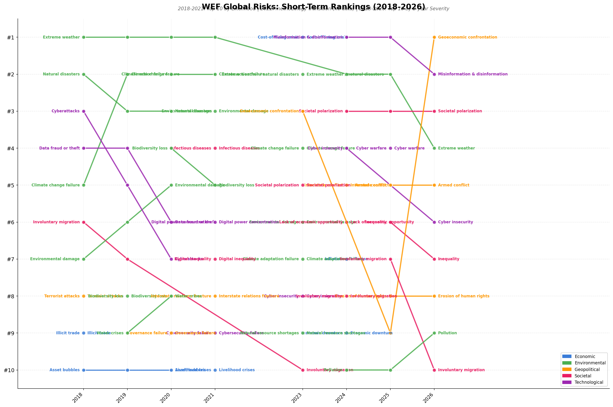
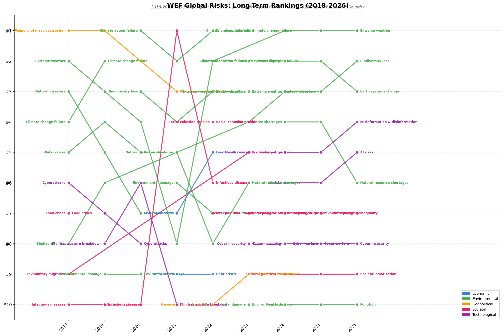
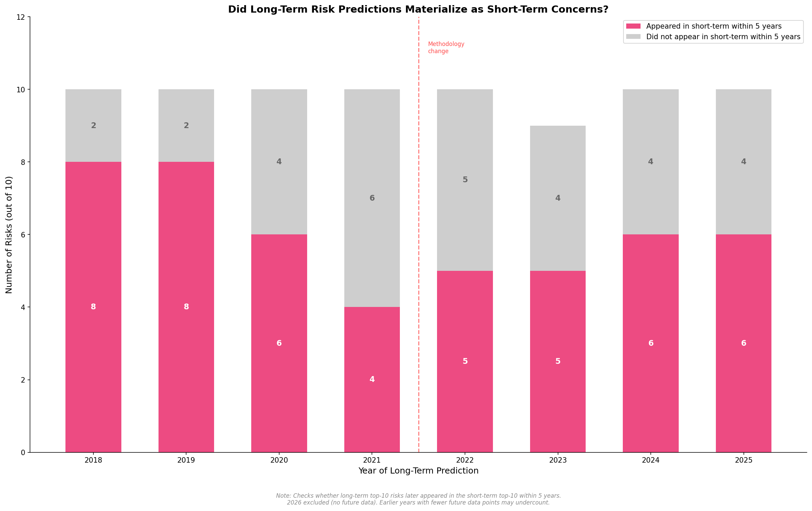
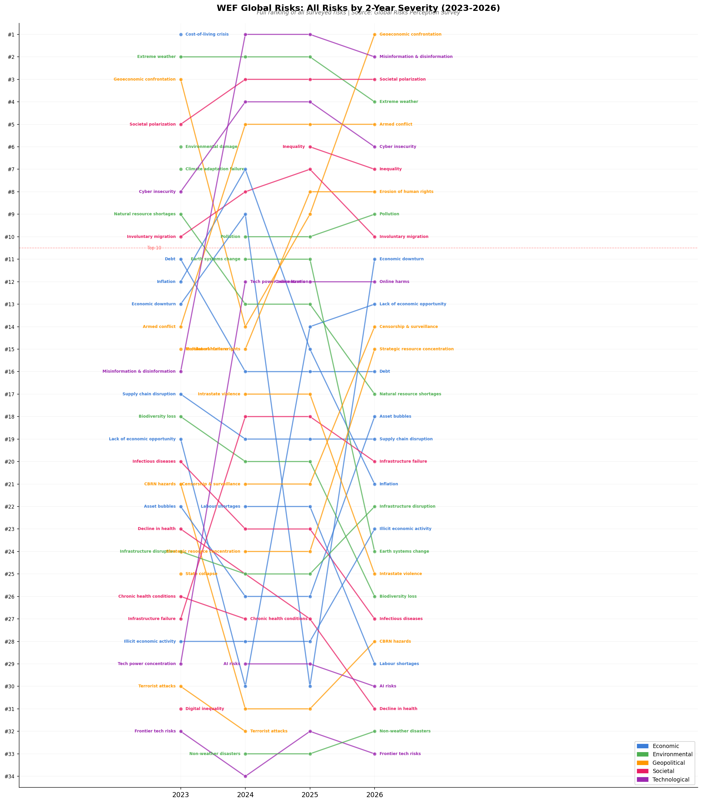
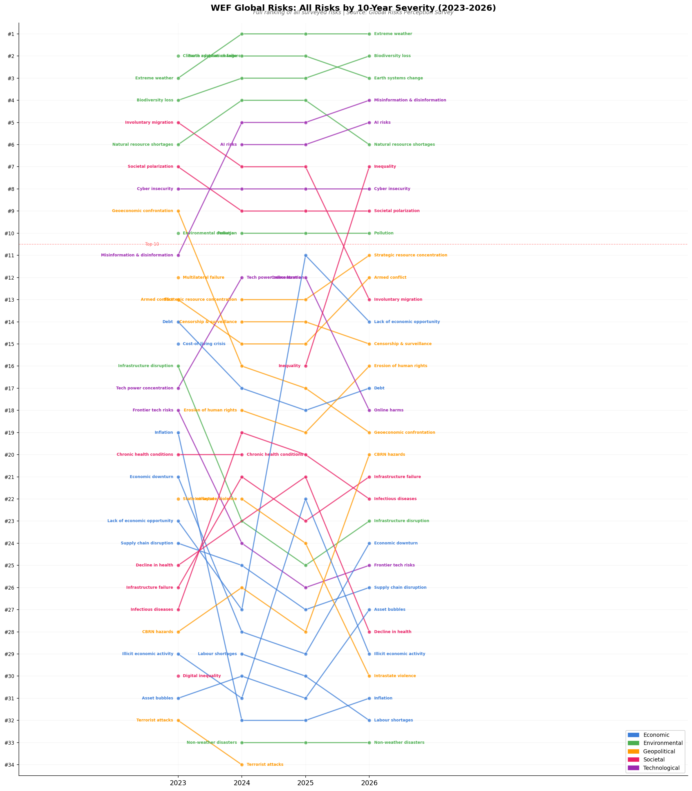
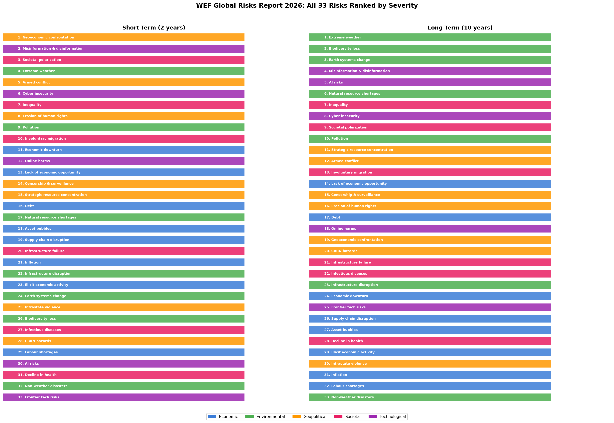

# WEF Global Risk Reports: 20 Years of Changing Risk Perceptions

An analysis of the World Economic Forum's Global Risk Reports (2007-2026), visualizing how expert perceptions of the world's most severe risks have evolved over two decades.

## The Big Picture

The WEF surveys ~1,000+ experts annually, asking them to rank 30-50 global risks. Over 20 years, the results tell a striking story about how the world's risk landscape has shifted:

**2007-2013**: Economic fears dominated (financial collapse, fiscal crises, asset bubbles)  
**2014-2019**: Environmental risks surged (climate change, extreme weather, biodiversity)  
**2020-2021**: Pandemic shock reshuffled everything  
**2022-2026**: Geopolitical fragmentation and technology risks (misinformation, AI, geoeconomic confrontation)

## Charts

### Short-Term Risk Rankings (2018-2026)


### Long-Term Risk Rankings (2018-2026)  


### Did Long-Term Predictions Come True?


**60-80% of long-term risk predictions appeared as short-term concerns within 5 years.** Extreme weather, climate change, and cyberattacks always materialize. Biodiversity loss never does — it's perpetually "over the horizon."

### Full 20-Year Timelines
- [Short-term rankings 2007-2026](output/full_timeline_short_term.png)
- [Long-term rankings 2007-2026](output/full_timeline_long_term.png)

### Animated Versions
- [Short-term animated](output/short_term_animated.gif)
- [Long-term animated](output/long_term_animated.gif)

### Full Rankings (All 33 Risks, 2023-2026)
From 2023 onward, the WEF reports rank all ~33 surveyed risks (not just a top 10). These bump charts show the complete picture:




### 2026 Dual Panel (All Ranks)


## ⚠ Methodology Discontinuity

The WEF changed its survey methodology in 2022, creating a break in the time series:

| Period | Short-term metric | Long-term metric | Risks ranked |
|--------|-------------------|------------------|:------------:|
| 2007-2017 | Likelihood (10yr horizon) | Impact (10yr horizon) | Top 5 |
| 2018-2021 | Likelihood (10yr horizon) | Impact (10yr horizon) | Top 10 |
| 2022 | *Not published* | Severity (10yr) | Top 10 |
| 2023-2026 | Severity (2yr horizon) | Severity (10yr horizon) | All 32-34 risks |

**Pre-2022**: Two independent dimensions — "How likely?" and "How impactful?"  
**Post-2022**: One combined dimension — "How severe?" — over two time horizons  

The risk list itself also changed many times. We normalize risk names across years (e.g., "Cyber attacks" → "Cyberattacks" → "Cyber insecurity") but some mappings are judgment calls.

## How to Run

```bash
cd wef-global-risks
uv sync
uv run python data.py      # Validate data
uv run python charts.py    # Generate all charts
```

## Data Sources

All data extracted from the official WEF Global Risk Report PDFs (2010-2026), available in the `reports/` folder. Historical data for 2007-2009 comes from the 2017 report's retrospective figure.
