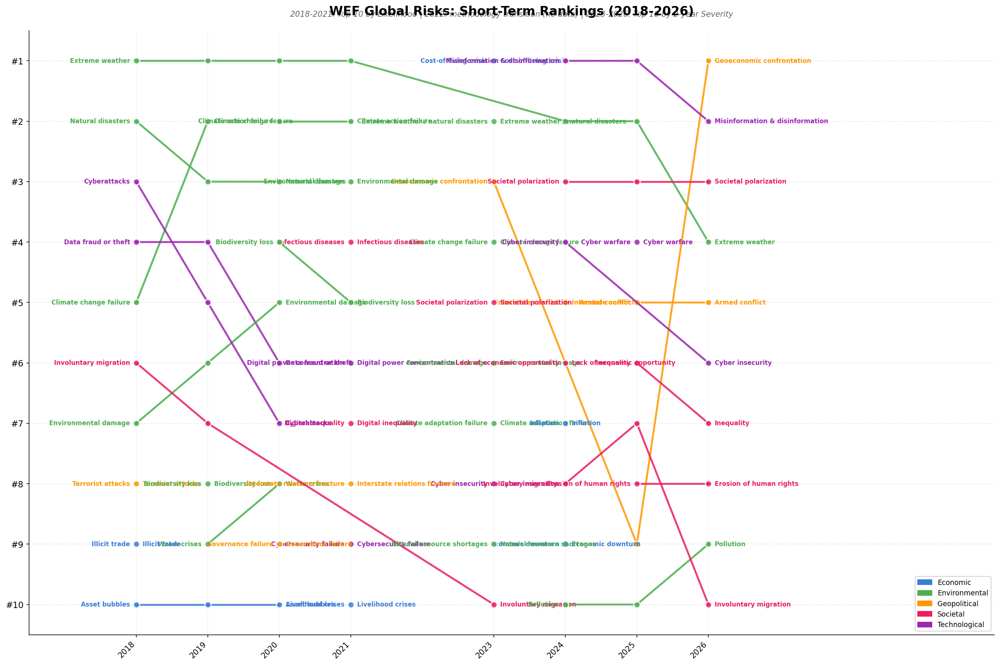
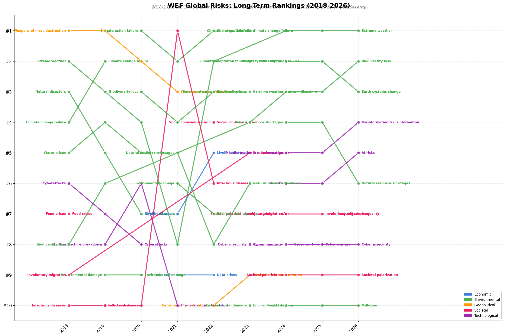
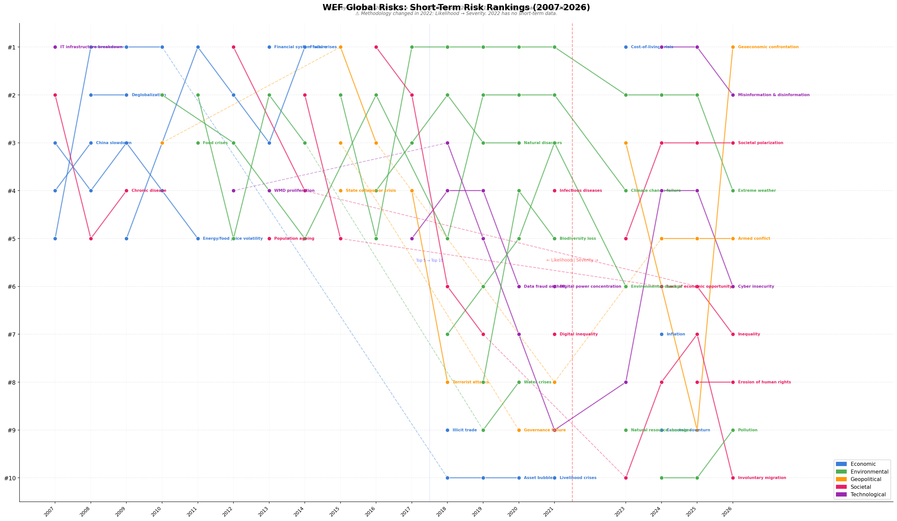
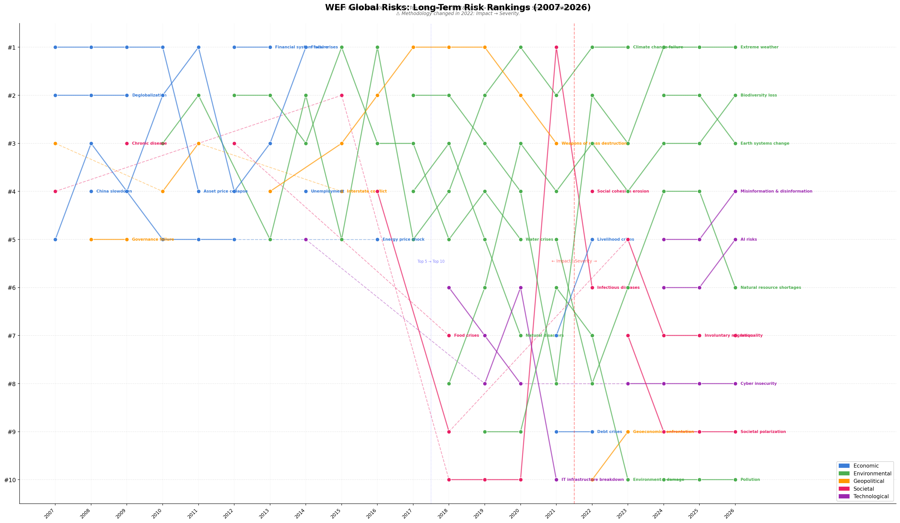

# WEF Global Risk Reports: Animated Rank Charts

*2026-03-27T08:29:14Z by Showboat 0.6.1*
<!-- showboat-id: 2399ad32-f793-4230-97a8-f10714b13162 -->

## Overview

This experiment analyzes the WEF Global Risk Reports (2007-2026) to visualize how perceived global risks have changed over two decades. We extracted risk rankings from 16 PDF reports and created animated bump charts showing the evolution of both short-term and long-term risk perceptions.

### Key Methodology Changes

The WEF changed its survey methodology significantly over time:

- **2007-2021**: Risks ranked by **Likelihood** (how likely to occur) and **Impact** (how severe if it occurs) — two separate dimensions
- **2022**: Transitional year — only a 10-year severity ranking published (no short-term)
- **2023-2026**: Risks ranked by **Severity** over **2-year** and **10-year** horizons — a single combined dimension

This means the time series has a discontinuity at 2022. The top-5 expanded to top-10 in 2018.

### Risk Categories
Risks are color-coded into five categories: Economic (blue), Environmental (green), Geopolitical (orange), Societal (pink), and Technological (purple).

## Data Extraction

We extracted risk rankings from 16 PDF reports covering 2007-2026. Let's verify the data:

```bash
uv run python data.py
```

```output
All 84 unique risk names have categories and normalizations.

Era 1 - Likelihood rankings: 2007-2021
  2007: 5 risks
  2008: 5 risks
  2009: 5 risks
  2010: 5 risks
  2011: 5 risks
  2012: 5 risks
  2013: 5 risks
  2014: 5 risks
  2015: 5 risks
  2016: 5 risks
  2017: 5 risks
  2018: 10 risks
  2019: 10 risks
  2020: 10 risks
  2021: 10 risks

Era 1 - Impact rankings: 2007-2021
  2007: 5 risks
  2008: 5 risks
  2009: 5 risks
  2010: 5 risks
  2011: 5 risks
  2012: 5 risks
  2013: 5 risks
  2014: 5 risks
  2015: 5 risks
  2016: 5 risks
  2017: 5 risks
  2018: 10 risks
  2019: 10 risks
  2020: 10 risks
  2021: 10 risks

Era 2 - 2022 severity (10-year): 10 risks

Era 3 - Short-term (2-year) rankings: 2023-2026
  2023: 10 risks
  2024: 10 risks
  2025: 10 risks
  2026: 10 risks

Era 3 - Long-term (10-year) rankings: 2023-2026
  2023: 10 risks
  2024: 10 risks
  2025: 10 risks
  2026: 10 risks
```

## Chart Generation

Now let's generate all the visualizations:

```bash
uv run python charts.py
```

```output
Creating WEF Global Risk Report visualizations...
============================================================

1. Creating full timeline charts...
Saved full_timeline_short_term.png
Saved full_timeline_long_term.png

2. Creating Top 5 era charts (2007-2017)...
Saved likelihood_top5_2007_2017.png
Saved short_term_top10_2018_2026.png
Saved short_term_animated.gif
Saved impact_top5_2007_2017.png
Saved long_term_top10_2018_2026.png
Saved long_term_animated.gif

=== Materialization Analysis ===

2018 long-term predictions → short-term within 5 years:
  8/10 (80%) materialized
  Materialized: Biodiversity loss, Climate change failure, Cyberattacks, Extreme weather, Infectious diseases, Involuntary migration, Natural disasters, Water crises
  Not yet: Food crises, Weapons of mass destruction

2019 long-term predictions → short-term within 5 years:
  8/10 (80%) materialized
  Materialized: Biodiversity loss, Climate change failure, Cyberattacks, Environmental damage, Extreme weather, Infectious diseases, Natural disasters, Water crises
  Not yet: IT infrastructure breakdown, Weapons of mass destruction

2020 long-term predictions → short-term within 5 years:
  6/10 (60%) materialized
  Materialized: Biodiversity loss, Climate change failure, Cyberattacks, Environmental damage, Extreme weather, Infectious diseases
  Not yet: IT infrastructure breakdown, Natural disasters, Water crises, Weapons of mass destruction

2021 long-term predictions → short-term within 5 years:
  4/10 (40%) materialized
  Materialized: Climate change failure, Environmental damage, Extreme weather, Natural resource shortages
  Not yet: Biodiversity loss, Debt crises, IT infrastructure breakdown, Infectious diseases, Livelihood crises, Weapons of mass destruction

2022 long-term predictions → short-term within 5 years:
  5/10 (50%) materialized
  Materialized: Climate change failure, Environmental damage, Extreme weather, Geoeconomic confrontation, Natural resource shortages
  Not yet: Biodiversity loss, Debt crises, Infectious diseases, Livelihood crises, Social cohesion erosion

2023 long-term predictions → short-term within 5 years:
  5/9 (56%) materialized
  Materialized: Cyberattacks, Extreme weather, Geoeconomic confrontation, Involuntary migration, Societal polarization
  Not yet: Biodiversity loss, Climate change failure, Environmental damage, Natural resource shortages

2024 long-term predictions → short-term within 5 years:
  6/10 (60%) materialized
  Materialized: Cyberattacks, Extreme weather, Involuntary migration, Misinformation and disinformation, Pollution, Societal polarization
  Not yet: AI risks, Biodiversity loss, Critical change to Earth systems, Natural resource shortages

2025 long-term predictions → short-term within 5 years:
  6/10 (60%) materialized
  Materialized: Cyberattacks, Extreme weather, Involuntary migration, Misinformation and disinformation, Pollution, Societal polarization
  Not yet: AI risks, Biodiversity loss, Critical change to Earth systems, Natural resource shortages

Saved materialization_analysis.png

3. Creating dual panel chart for 2026...
Saved dual_panel_2026.png

============================================================
All visualizations saved to output/
```

## Short-Term Risk Rankings (2018-2026)

This chart shows how short-term risk perceptions evolved from 2018-2026. Pre-2022, risks were ranked by *likelihood* of occurring. From 2023, they are ranked by *2-year severity*. Note the gap at 2022 (methodology transition).

```bash {image}

```



### Key observations:
- **Extreme weather** has been the dominant short-term concern since 2018, appearing in the #1 or #2 position almost every year
- **Cyberattacks/cyber insecurity** has been a persistent presence throughout
- **Misinformation & disinformation** burst onto the scene in 2023 and quickly rose to #1 in 2024
- **Geoeconomic confrontation** surged to #1 in 2026, reflecting trade/sanctions concerns
- Environmental risks dominated pre-2022; societal/geopolitical risks dominate post-2022

## Long-Term Risk Rankings (2018-2026)

This chart shows long-term risk perceptions. Pre-2022, risks were ranked by *impact* (severity if they occur). From 2022, they are ranked by *10-year severity*.

```bash {image}

```



### Key observations:
- **Climate change / Extreme weather** has dominated the long-term outlook for nearly every year
- **Biodiversity loss** has been a consistent top-5 long-term concern since 2018
- **Weapons of mass destruction** held #1 by impact in 2017-2019, then dropped off entirely post-2022
- **AI risks** is a notable new entrant, appearing at #6 in 2024-2026
- Environmental risks remain dominant in the long-term outlook even as they've faded from short-term concerns

## Did Long-Term Predictions Materialize?

A key question: do the risks that experts flag as long-term threats actually become short-term concerns within 5 years?

```bash {image}

```


### Findings:
- **60-80% of long-term predictions materialized** as short-term concerns within 5 years (2018-2019 era)
- Post-methodology change, the rate hovers around **50-60%**
- Risks that **consistently fail to materialize** as short-term: Weapons of mass destruction, Biodiversity loss, IT infrastructure breakdown
- Risks that **always materialize**: Extreme weather, Cyberattacks, Climate change failure
- **Biodiversity loss** is a fascinating case — it's been a top-5 long-term concern since 2018 but has *never* appeared in the short-term top 10. This suggests experts view it as a slow-burn crisis that's always 'over the horizon'
- **AI risks** appeared in long-term rankings in 2024 at #6 — will it become a short-term concern soon?

## Full 20-Year Timeline

For the full picture, here are the complete timelines spanning 2007-2026 (with normalized risk names tracked across methodology changes):

```bash {image}

```



```bash {image}

```



## Animated Versions

The animated GIF versions of the bump charts reveal the data year by year:
- `output/short_term_animated.gif` — Short-term risks 2018-2026
- `output/long_term_animated.gif` — Long-term risks 2018-2026

## Methodology Discontinuity Note

⚠ **The time series is not fully contiguous.** 

| Period | Short-term metric | Long-term metric | # Risks ranked |
|--------|-------------------|------------------|----------------|
| 2007-2017 | Likelihood (10-year) | Impact (10-year) | Top 5 |
| 2018-2021 | Likelihood (10-year) | Impact (10-year) | Top 10 |
| 2022 | *No short-term data* | Severity (10-year) | Top 10 |
| 2023-2026 | Severity (2-year) | Severity (10-year) | Top 10 |

The shift from Likelihood/Impact (two independent dimensions) to Severity (a single combined dimension) in 2022-2023 means pre-2022 and post-2022 rankings are not directly comparable. The risk list itself also changed — new risks were added and names were updated.
